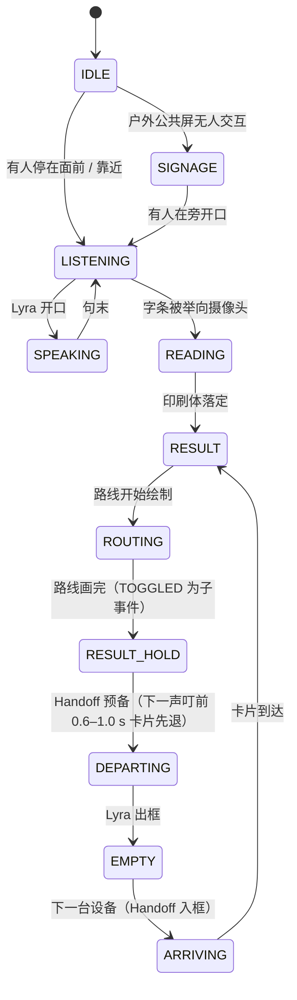

# 05 · Claude Code Motion Graphic + LiveX Screen UI 设计规范 ——《7 路》Route 7

> LiveX AI City · 60 秒品牌影片 · 动态图形与屏幕 UI 规范（Claude Code 执行）
> **权威来源**：`docs/master.json`（镜号、时间码、台词、UI 文案，本文逐字引用）· `docs/_input/product_bible.md`（产品外观、尺寸、比例、屏幕、边框、底座、材质、安装方式）· `docs/concepts.json`（winner = STRATEGIST2+《7 路》；嫁接 The Handoff / Center-Lock / 两笔成 X / 指向即现实 / 安静的一拍 / 光形语法；tagline「Ask the city.」）· `docs/_input/design_system.md`（已实现的 Claude Code 动态影片系统，是本文的底座）· `docs/_input/sound_system.md`（120 BPM / E 调声音引擎，本文所有 UI 事件的拍点来源）
> **规格**：主版 1920×1080 · 30 fps · 60.0 s（第 0–1799 帧）；X 版 1080×1350（4:5）；所有 LiveX 屏幕 UI 画布 1080×1920（9:16），用单应矩阵贴进真实产品屏幕四角。
> **两条生产线共用本文**：① Claude Code 纯代码影片（`film/src`，每一帧都是时间 t 的纯函数）；② 生成版（GPT-image → Seedance）的屏幕 UI 与影片层图形合成层。两条线用同一套 UI、同一张时间表。

---

## 目录

- [0. 总则](#0-总则)
- [1. Layout：画幅、安全区、网格、锚位](#1-layout画幅安全区网格锚位)
- [2. Typography：三种声音与字阶](#2-typography三种声音与字阶)
- [3. Graphic System：色彩、图形家族、光形语法](#3-graphic-system色彩图形家族光形语法)
- [4. Easing：命名曲线](#4-easing命名曲线)
- [5. Blur：模糊的用途与上限](#5-blur模糊的用途与上限)
- [6. Depth：空间、景深、图层](#6-depth空间景深图层)
- [7. Motion：原则与《7 路》专属组件库](#7-motion原则与7-路专属组件库)
- [8. UI State：每场景状态机](#8-ui-state每场景状态机)
- [9. Transition：全片转场表](#9-transition全片转场表)
- [10. Timing：逐镜头 UI 事件时间表（120 BPM）](#10-timing逐镜头-ui-事件时间表120-bpm)
- [11. 与 Seedance 素材合成](#11-与-seedance-素材合成)
- [12. 禁止项](#12-禁止项)
- [13. 代码对齐清单：film/src 与 master 的差异](#13-代码对齐清单filmsrc-与-master-的差异)
- [14. 交付与验收](#14-交付与验收)
- [附录 A · 文案总表（逐字）](#附录-a--文案总表逐字)

---

## 0. 总则

### 0.1 优先级

`master.json` > `product_bible.md` > **本文** > `design_system.md`。本文在已实现的设计系统之上扩展《7 路》专属组件；两者冲突时按 master 裁定（见 0.4）。master 没有规定、由本文补足的参数，一律标注「**本文补**」，它们不改动 master 已有的任何内容。唯一的例外是 0.4 #18（生成版的屏幕底板按模式区分）：它是 03 / 04 / 05 共同采用的生产修正，改的是 master world_bible 里一句制作方法，不涉及镜号、时间码、台词和 UI 文案，需要回写 master。

### 0.2 系统就一句话

**一张字条 + 一条线路 + 一块站牌。**

- **字条**是人：孙女的铅笔字，石墨，米白纸。它在 15.9 s 变成 Lyra 的印刷体，在 57.15 s 变成 X 的第一笔。
- **线路**是 Lyra：一条 3 px 的钴蓝路线。它从路线卡里画出来，越出卡片右缘，指向真实的 Exit B；在 57.2 s 变成 X 的第二笔。
- **站牌**是城市：Geist Mono，灰底白字，方角，近不透明（86%）。它只在「叮」的那一帧出现，从不自己说话。
- **两种字体就是两种声音**：人说的话用 Instrument Serif Italic，Lyra 与所有 UI 用 Geist，事实（站号、时间、年份、标签）用 Geist Mono。
- **钴蓝 #2F5BEA 只属于 Lyra「活着」的信号**，暖红 #C8372D 只属于陈师傅的围巾。句号在最后 0.35 秒从红变成蓝，这是全片唯一一次两种颜色相遇。
- **节点只靠产品自己的光被认出**：Gateway 是两道白色竖条，Paragon 是上下两块白色矩形，Portal 是一圈蓝色墙晕。全片不画一根连线。

### 0.3 70 / 20 / 10 落到图形层

| 比例 | 在本片里是什么 | 规则 |
|---|---|---|
| 70% Reality | 产品抠像的真实像素、真实尺寸（Gateway 218 cm、Paragon 246 cm、Portal 屏幕中心 150 cm）、真实光源（LED 灯条、灯箱、墙晕）、剪影与真实比例 | 图形层不得改变产品外观；设备在画面里永远静止 |
| 20% Design | 屏幕 UI（Lyra OS）、站牌字卡、双字体字幕、End Card | 每个图形元素必须有来源：设备屏幕（剧情内）、铃声（站牌）、人声（字幕） |
| 10% Future | 只有三处：铅笔字变印刷体（15.9）、Handoff（27.767 / 29.767）、七声铃点亮全城（53.5–57.0） | 「未来感」只来自这三处，其他地方一律克制 |

### 0.4 已裁定的来源冲突

| # | 冲突 | 裁定 |
|---|---|---|
| 1 | design_system：Instrument Serif「全片只用一次」；master：「人说的话一律 Instrument Serif Italic」 | 按 master。Instrument Serif Italic = 人的声音；End Card 的「Ask the city.」也用它（这是人向城市提问），句号变钴蓝 = 城市回答 |
| 2 | design_system：Geist Mono「全大写」；master 站牌与节点标签为大小写混排（「05 · Harbour Interchange」「01 · St. Mary's」） | 逐字按 master，**禁止** `text-transform`。眉标在 master 里本身是大写（ROUTE / PICKED FOR TONIGHT / TONIGHT） |
| 3 | 品牌线字号：design_system 46 px；master S18 56 px | 56 px |
| 4 | 七声铃：concepts「八分音符，间隔 0.25 s」、代码 55.25 起；master「53.5–56.5，每 0.5 s」 | 按 master |
| 5 | End Card：concepts 57.3 / 57.9 / 58.2 / 58.6 / 59.1；master 57.15 / 57.5 / 58.0 / 58.5 / 59.0 / 59.25–59.6 | 按 master（已量化到 0.5 s 拍点） |
| 6 | 站牌字卡位置：代码 y 912；master y 940 | y 940 |
| 7 | 路线线宽：代码 6 px；master「3 px 圆头」 | 3 px |
| 8 | S03 导向牌：代码版在焦平面上可读（Exit A / Exit B / Stadium · Gate C）；master「不写字」 | 按 master：深灰圆角矩形 + 白色箭头图形 + 四行灰色短条 |
| 9 | 片尾 credit 小字：代码 `s5_final.js` 有；master「片中不再叠加其他文案」 | 删除，移到 X 帖子正文 |
| 10 | 箭头卡：代码带副行「Route 7」；master「无副行」 | 无副行 |
| 11 | 焦距常数：design_system F = 1150；master S03「Space（F 1100）」 | S03 用 1100，其余镜头 1150 |
| 12 | S16 站牌：concepts「副行翻成 07 · Last stop」；master「主行站名翻成 Last stop，『07 ·』不动」 | 按 master |
| 13 | S07：master motion「逐字错峰 45 ms，总长 0.8 s（15.9–16.7），每字一声『嗒』同帧」；master sound「每字一嗒（十六分音符）」。整行 27 个字形如果一个接一个错峰 45 ms，需要 26 × 45 + 350 = 1 520 ms，放不进 0.8 s | 按 master **逐字**，不改成逐词。整行按两个「→」拆成三段路线，三段在 15.9 同时起步，段内逐字错峰 45 ms，每字 0.35 s；最长一段 11 个字形，10 × 45 + 350 = 800 ms，正好 15.9–16.7。声音用双层（与 06 §5.3 一致）：十六分网格上 6 声重音「嗒」（16.0–16.625）+ 每个印刷字形在自己起点那一帧各一声轻「嗒」（−9 dB），共 27 声（7.2.5） |
| 14 | S17：「约 420 个节点以 20–60 ms 随机延迟逐个亮起」，但 56.5–57.0 只有 0.5 s | 解释为「由内向外 0.40 s 的距离波，每个节点再加 20–60 ms 随机抖动」，57.0 前全部亮完（7.12.4） |
| 15 | 字幕位置：代码 y 858 / 968；master y 940 | y 940（16:9）；4:5 上移一行（1.2.3） |
| 16 | 影片层地点字幕：design_system「地点字幕条 17 mono 0.22em + 56px 细线」与转场「地点字幕条从细线延展而出」；master「站牌字卡 StopCard」主行 22 px / 副行 13 px | 由《7 路》的 StopCard（主行 22 px / 副行 13 px，7.4）取代。地点字幕条、它的 56 px 细线和「从细线延展而出」的转场在本片都不用（代码 `places.js` 的 `Slug` 不实例化，见 13） |
| 17 | Lyra idle 呼吸：design_system 与 master 人物圣经「0.35% @0.24 Hz」（代码 `1 ± 0.0035`）；master S05「idle(t)：scale 1.000→1.004（0.24 Hz）」 | 按 master 镜头级写法：scale = 1 + 0.004 × breathe(0.24 t)，在 1.000 与 1.004 之间往返（以 1.002 为中心 ±0.2%，峰值 +0.4%）。0.35% 视为同一量级的旧写法，全片统一用 1.000→1.004（7.6） |
| 18 | 生成版屏幕底板：master world_bible「屏幕生成纯黑后期贴 UI」、concepts production_risks「屏幕一律生成纯黑」；但浅色模式的亮屏是场景里真实的主光（master S06「屏幕是她脸上唯一的冷白光源」，S09「冷白轮廓光来自屏幕」），黑屏生成不出这层光和地面倒影 | 按屏幕模式区分：浅色屏（Gateway、日间 Portal）生成均匀发光的**浅灰白**（线性光约为 --paper 的 85%，保留 3–5% 玻璃反光），深色屏（Paragon、医院夜间 Portal）才生成**纯黑**（11.0）。与 03 §5、04 §1.6 一致；master world_bible 那一句需同步改为「浅色屏生成浅灰白、深色屏生成纯黑」 |
| 19 | 站牌副行：master 只给了 05 / 06 / 07 三块站牌的副行（`Route 7 · 18:31` / `18:41` / `18:52`）；S15 倒卷块与 S16 Last stop 在 master onscreen_text 与 01 §7.6 里都只有主行 | 按 master：46.5–51.6 的倒卷块与 52.0 的 Last stop 块**只有主行**（框高 50），本文不补副行，也不翻分钟。上游四站的「同一分钟」由五格状态栏的 18:53 承担（master S15 ui_zh，7.4） |

### 0.5 记号

- **时间** t 以秒计；**帧** f = t × 30。非整数帧（如 46.25 = f1387.5）上的视觉事件取 `ceil`，声音按采样点精确。
- **小节.拍**：bar = ⌊t / 2⌋ + 1，beat = ⌊(t mod 2) / 0.5⌋ + 1；「&」= 该拍后半（+0.25 s）。例：25.5 s = **13.4**（第 13 小节第 4 拍），18.5 s = 10.2，58.0 s = 30.1。
- **坐标**：影片层 px（1920×1080，左上原点）；画布 px（1080×1920）；4:5 px（1080×1350）；世界 cm（`Space`）。
- **组件名**沿用 `film/src`：`Space`、`StagedDevice`、`frameScreen`、`LyraScreen`、`Card`、`RouteMap`、`Voice`、`Caption`、`StopCard`、`Subtitle`、`SplitFlap`、`Film16`、`RollSign`、`Note`、`FlipPhone`、`Rain`、`ClockTower`、`Chen`、`City`、`NodeLabel`、`EndCard`、`kf`、`spline`、`reveal`、`pulseRing`。

---

## 1. Layout：画幅、安全区、网格、锚位

### 1.1 影片层 1920×1080

**安全区**
- Action safe：x 96–1824 / y 54–1026（5%）。所有影片层文字都在其内。
- **中央安全列**（4:5 的来源）：x 528–1392（864 px）。Lyra 双眼、所有关键动作、字幕与 End Card 都落在列内。

**影片层不用栏网格。** 全片的影片层文字只允许出现在 4 个固定锚位加 1 类世界锚定上。少即是系统：观众 60 秒里只需要学会「左下角是站牌，底部是话」。

| 锚位 | 16:9 位置 | 4:5 位置（4:5 px） | 组件 | 出现时段 |
|---|---|---|---|---|
| **A1 左上角标** | 左上角 (96, 64) | (45, 80) | 年份「1985」→「2026」（Geist Mono 18） | 0.0–3.2 |
| **A2 左下站牌** | 左上角 (96, 940)，框高 70（有副行）/ 50（只有主行），宽 ≤ 424（右缘 ≤ 520） | (45, 1175)，框高 88 / 63 | `StopCard` / 箭头卡 | 25.5 起的每一个「叮」 |
| **A3 底部字幕带** | 水平居中 x 960，**末行**顶 y 940，行高 56，最大行宽 792（x 564–1356） | 上移一行：末行顶 1105，最大行宽 990 | `Subtitle`（双字体）+ 影片层语音线 | 9.0 起所有台词 |
| **A4 中心** | 视觉中心 (960, 507) = 画高 47% | (540, 567) = 画高 42% | `EndCard` | 57.15–60.0 |
| **W 世界锚定** | 锚在节点或人物上，1 px 竖向引线 | 必须落在安全列内 | `NodeLabel` | 53.0；53.5–57.0 |

两个特殊注册点（不是文字锚位，是剪辑的对位点）：

| 注册点 | 16:9 | 4:5 | 用途 |
|---|---|---|---|
| **C1 Center-Lock 眼点** | (960, 405)，双眼间距 20 px；屏幕框 x 799–1120 / y 322–893（321×571） | (540, 506)，双眼间距 25 px | 47.0–52.0 五格蒙太奇 |
| **C2 匹配剪辑「7」** | 字中心 (700, 470)，字高 220 px | 原生重排：(540, 675)，字高 264 px | 1.2–1.833 卷帘牌「7」→ Seat 7 |

**A2 与 A3 在 16:9 里共用 y 940 这一行，但水平上不相交**：站牌右缘 ≤ 520，字幕左缘 ≥ 564。所以 42.0 的站牌退场（43.12–43.47）和 43.2 的第一句字幕可以同时在画面上。

**时钟 HUD 关闭。** 设计系统里的 `Clock`（右上角走秒）在《7 路》里不用。时间只出现在两处：站牌副行（「Route 7 · 18:31」）和设备状态栏。

### 1.2 X 版 4:5（1080×1350）

#### 1.2.1 换算

默认从 16:9 中央安全列裁切放大 1.25 倍：

```
x45 = (x169 − 528 − Δ) × 1.25        y45 = y169 × 1.25
```

Δ 是逐镜头的水平重构偏移，默认 0，上限 ±200 px，只能在有摄影机运动的镜头里随运动变化，不能在锁定镜头里单独漂。
**图形层不从 16:9 成片里裁。** 站牌、字幕、节点标签、End Card 都按上表的 4:5 锚位原生渲染（矢量 1.25×），画面层才做裁切放大，这样文字始终锐利。

#### 1.2.2 4:5 安全区与平台遮挡带

- Action safe：x 45–1035 / y 60–1270。
- **y ≥ 1270 是平台遮挡带**（信息流里播放器的时长徽标和声音按钮在这里），不放任何文字。站牌底边在 4:5 里是 1175 + 88 = 1263，刚好在带外。

#### 1.2.3 底部带在 4:5 里改成上下两行

4:5 的安全列太窄，站牌和字幕放在同一行会水平相撞。所以 4:5 版的**字幕带上移一行**：字幕末行顶 1105（16:9 坐标写作 y 884），站牌在它正下方 1175。两者因此永远不会重叠，包括 42.0–43.47 站牌还没退完、43.2 字幕已经开始的那 0.27 秒。

#### 1.2.4 原生重排的镜头

以下三个镜头的 4:5 版不是裁切，而是按 4:5 重新排版：

| 镜头 | 为什么 | 4:5 版式 |
|---|---|---|
| **S01**（0.0–1.5） | 16:9 的 4:3 遮幅左右各 240 px 黑边，裁切后安全列落在 4:3 画面内部，看不到「4:3 → 全画幅」这个动作 | 4:3 窗口 1080×810，居中于 y 270–1080，上下各 270 px 黑边；1985 画面按 1.2 倍放进窗口（窗口里是源图 900×675 的区域），卷帘牌「7」注册到 (540, 675)、字高 264 px。「1985」在上方黑边的 (45, 80)。1.5 起窗口在 10 帧内上下推开到 1080×1350（push） |
| **S02**（1.5–4.5） | 16:9 里字条宽 62%（约 1190 px），比 864 px 的安全列还宽，裁切会把字切掉；master 要求 4:5 字条宽 ≥ 60% | 首帧 Seat 7 的「7」注册到 (540, 675)、字高 264 px，继承 12° 旋转；1.5–2.5 后拉到字条宽 972 px（画宽 90%）。代码版原生渲染 4:5；生成版需要一条单独的竖幅素材（建议在 04 文档里补一条 J02-V：同首帧，9:16，裁成 4:5） |
| **S18**（57.0–60.0） | End Card 需要重新配重 | 三行居中，整体视觉中心上移到 y 567（42%），全部尺寸 × 1.25 |

#### 1.2.5 逐镜头 4:5 检查点

| 镜头 | 必须留在 4:5 画框内的东西 |
|---|---|
| S07 | 镜片（反光里的路线卡）与字条的上半 |
| S08 | 路线越出卡片右缘的箭头，以及画面右缘 Exit B 的暖色焦外 |
| S09 | 26.4 海报帧：Gateway 整机、陈师傅（红围巾）、以及 Exit B 扶梯暖光（16:9 x ≤ 1356）。「指向即现实」不能被裁掉 |
| S11 | Gateway 屏幕与 Stall 4（必要时用 Δ 跟随横移） |
| S14 | 42.0 钟楼与 Paragon 同框（Δ 可取 −120）；43.0 手掌、红砖、Paragon 屏幕三者 |
| S15 | Center-Lock 眼点 (540, 506)，五格 UI 卡片 |
| S16 | 52.5 看台里的「一张白纸、一点红」 |
| S17 | 所有节点标签（靠近列边缘的节点，标签翻到引线左侧） |

### 1.3 屏幕 UI 画布 1080×1920（Lyra OS）

#### 1.3.1 网格

- 边距 64 px；6 栏，槽宽 24 px（内容宽 952，栏宽 138.67）。
- 8 px 基线，允许 4 px 半步。
- 同一套画布用于全部 5 种设备（Gateway 86″、Paragon 65″、Portal 55″ / 43″ / 32″）。「One OS, many places」：设备不同，版式、字体、动效完全相同，只有内容随地点变。

#### 1.3.2 分区

| 区 | y 范围 | 内容 | 规则 |
|---|---|---|---|
| Z0 状态栏 | 52–108 | 左：LiveX X 标志 30 px + 地点名（Geist Mono 22）；右：时间（Geist Mono 22，等宽数字）+ 钴蓝在场点 16 px | 始终存在，是设备而不是 Lyra 的一部分 |
| **Z1 Lyra 保护区** | 0–1000 | Lyra 头顶约 y 154（画布 8%），**眼点常量 EYE = (542, 280)**，腰与交握的手约在 y 860–1000 | 除状态栏外任何 UI 禁入。在 1:1 的 Gateway 上，这里是一个真人的头胸，遮挡就等于挡住一个人的脸 |
| Z2 字幕带 | 1030–1150 | 屏幕内字幕胶囊（Lyra 说话时） | 只有 Lyra 的话会上屏；人说的话从不上屏 |
| Z3 内容卡区 | 1160–1740 | 卡片默认顶边 1180，左右各 64 | 卡片只盖 Lyra 腰部以下 |
| Z4 语音线 | 1760–1820 | 钴蓝示波线，**线中心 y 1790**（与 master S05 / S09 / S14 和 design_system 一致），宽 420，线粗 4 px，振幅限幅 ±30 px（不出本区） | listening 时平静呼吸，speaking 时由分层噪声驱动 |
| 底边距 | 1820–1920 | 空 | — |

**Lyra 底图**：`light` = lyra_white 白色影棚（右侧柔和投影），用于 Gateway 与白天的 Portal；`dark` = lyra_black 纯黑，背景为径向渐变 #1a2030 → #07090d，用于 Paragon 与夜间模式的 Portal（01 · St. Mary's）。两张底图都要平移到让双眼中点正好落在 EYE (542, 280)。

#### 1.3.3 卡片版式（画布 px）

所有卡片：圆角 36；内边距 40；浅色 `rgba(255,255,255,.74)` + backdrop blur 28 px saturate 1.5 + 1.5 px 白色描边 + 阴影 `0 30px 80px rgba(18,28,58,.14)`；深色 `rgba(18,22,30,.62)` + 同样的 blur + 1.5 px `rgba(255,255,255,.14)` 描边。

**A · 路线卡**（05 · Gateway，S07–S10a）：x 64–1016，y 1180–1600（高 420 ≈ 屏高 22%，即 master 所说的「屏幕下方 22%」）

| 行 | y | 内容 | 样式 |
|---|---|---|---|
| 眉标 | 1220–1246 | `ROUTE` | Geist Mono 21 · 0.16em · ui-ink-3 |
| 标题 | 1262–1322 | `Exit B → Market Hall → Gate C` | Geist 50 / 600 / −0.025em · ui-ink |
| 数字 + 线路图 | 1338–1430 | 左：`9 min`（Geist 84 / 500 / −0.04em，等宽数字）；右：`RouteMap` 细线平面图 x 330–976 | 钴蓝路线从左画到右，箭头越出卡片右缘到 x 1044 |
| 分隔线 | 1450 | 1 px `rgba(13,17,23,.08)`，x 104–976 | — |
| 开关行 | 1466–1560 | 左：`Step-free route`（Geist 29 / 1.38 · ui-ink）；右：开关 88×48（x 888–976，中心 y 1513） | 见 7.7.2 |

**B · Exit B 卡**（Portal 55，S10）：x 64–1016，y 1180–1420
- `Exit B ↑`：Geist 84 / 500，「↑」为钴蓝；
- `Market Hall 120 m`：Geist 29，ui-ink-2；
- 一条钴蓝竖线（3 px 圆头）从卡片顶边、对齐「↑」字形中心，向上画出 120 px（y 1180 → 1060），停在 Lyra 保护区之外。

**C · 商品卡**（06 · Gateway，S11）：x 64–1016，y 1180–1720
- 眉标 `PICKED FOR TONIGHT`（y 1220）；
- 标题 `No. 7 · Home scarf`（y 1256–1316，50 / 600）；
- 产品图 872×220（y 1336–1556，圆角 20）：代码绘制的藏青 #1c2a4a 白竖条针织围巾，横向平铺，小 V 形针脚重复加 0.5 px 噪声；
- 底行 y 1580–1680：左 `Last 3`（「Last」Geist 29 · ui-ink-2，「3」Geist 84 / 500，基线对齐）；右 `Stall 4 →`（Geist 29 / 600，「→」钴蓝）。

**D · 活动卡**（07 · Paragon，深色，S14）：x 64–1016，y 1180–1600
- 眉标 `TONIGHT`；
- 标题 `Harbour FC Women`；
- `Kick-off 19:30`（「Kick-off」29，「19:30」84 / 500）；
- 行动行 `Gate C → 120 m · short queue`（29，「→」钴蓝）。

**E · 蒙太奇卡**（S15 五格，同一个位置）：x 64–1016，y 1180–1500。五格都是 1.0 秒，屏幕在影片里只有 571 px 高（画布到影片的缩放是 0.2976），所以用两级字阶（不新增字号，复用 84 与 50）：
- 第一行 = 标题行，Geist 84 / 500 → 影片上约 25 px；
- 第二行 = 补充行，Geist 50 / 600 → 影片上约 15 px；
- 01 格另有一条音量滑杆：y 1440，轨 872×6，滑块 28 px，钴蓝填充。

**「 · 」拆行规则**：master 的屏幕文案里，「 · 」是字段分隔符。同一行显示时保留「 · 」；拆成两行时，由换行代替那一个「 · 」，字符和顺序不变。先例是 master S10：`Exit B ↑ · Market Hall 120 m` 在 ui_zh 里就排成了大号「Exit B ↑」加副行「Market Hall 120 m」。影片层文字（站牌、节点标签、字幕）一律不拆。

**状态栏**：X 标志 30 px（x 64）→ 12 px 间距 → 地点名；右侧时间右对齐到 x 980 → 20 px 间距 → 在场点（x 1000–1016）。在场点：钴蓝实心 16 px，外圈呼吸 6→11 px，透明度 0.10 ± 0.08，约 0.8 Hz。

**屏幕内字幕胶囊**：居中，最大宽 900，内边距 22 / 40，Geist 500 46 / −0.02em；浅色 `rgba(255,255,255,.72)` + blur 24 saturate 1.4；深色 `rgba(18,22,30,.62)`。

### 1.4 设备物理换算（画布 px → 真实尺寸）

**屏幕与机身是两套口径**，全文（以及 03 §5、04 §1.6）统一如下。五种屏幕都是 16:9 竖屏，正视高宽比约 1.78。

| 设备 | 屏幕可视区（宽 × 高，约） | 机身（宽 × 高） | 1 画布 px ≈ | 50 px 标题的真实字高 | Lyra 比例 | 屏幕中心离地 |
|---|---|---|---|---|---|---|
| Gateway V2 86″ | 107 × 190 cm | 114 × 218 cm（深 60，含底座） | 0.99 mm | 5.0 cm | 1:1（眼高 ≈ 1.75 m，与画布 EYE y 280 对应） | ≈ 113 cm（落地） |
| Paragon Outdoor 65″ | 81 × 143 cm | 97 × 246 cm（深 90） | 0.75 mm | 3.7 cm | ≈ 0.75× | ≈ 118 cm（落地） |
| Portal 55″ | 68 × 121 cm | 73 × 125 cm | 0.63 mm | 3.2 cm | ≈ 0.6× | 150 cm（壁挂） |
| Portal 43″ | 53 × 95 cm | 57 × 99 cm | 0.49 mm | 2.5 cm | ≈ 0.5× | 150 cm（壁挂） |
| Portal 32″ | 40 × 71 cm | 43 × 74 cm | 0.37 mm | 1.8 cm | ≈ 0.35× | 150 cm（壁挂，高于约 100 cm 的三辊闸） |

屏幕尺寸由对角线和 16:9 算出（例：55″ → 68.5 × 121.8 cm）；product_bible 里「55″ 约 73 × 125 cm」是 Portal 的**机身**（28.6 × 49.4 in），不是屏幕。

一套画布在不同设备上自动得到符合观看距离的真实字号。**不得为某台设备单独放大 UI**，否则 Lyra 与 UI 的比例会破坏产品真实尺寸。

---

## 2. Typography：三种声音与字阶

### 2.1 字体分工

| 声音 | 字体 | 用在 | 不用在 |
|---|---|---|---|
| **人** | Instrument Serif Italic | 陈师傅、外国球迷的台词字幕；End Card 品牌线「Ask the city.」 | 任何 UI、任何 Lyra 的话 |
| **Lyra / UI** | Geist（500 / 600） | Lyra 的台词字幕（影片层与屏幕内）、全部屏幕 UI、End Card「AI City」 | 人的台词 |
| **事实** | Geist Mono（400 / 500） | 站牌字卡、年份角标、节点标签、状态栏、眉标、翻盖机外屏 | 句子 |
| **手** | 真实手写扫描的矢量路径（不是字体） | 字条上的两行字，包括全片仅有的中文「奶奶」和「林」 | 任何排印。全片不排任何中文 |
| **品牌** | brand.js 的 MARK + LIVEX.AI 字标（矢量） | 状态栏 X、Paragon 背面、End Card 锁定组合 | 不得用字体重打 LIVEX.AI |

观众不需要被告知这套规则：前 15 秒里，「They built a stadium on my bus depot.」（衬线斜体）和「Route 7's last stop. I know it.」（Geist，下面带一条钴蓝线）并排出现两次，就学会了。

### 2.2 影片层字阶（16:9 px；4:5 × 1.25）

| 元素 | 字体 | 字号 / 字重 | 字距 | 行高 | 颜色与处理 |
|---|---|---|---|---|---|
| 年份角标 1985 / 2026 | Geist Mono | 18 / 500 | 0.18em | — | 白 80% |
| 站牌主行 | Geist Mono | 22（站号 500，站名 400，「·」50% 不透明） | 0.08em | 26 | 白 |
| 站牌副行 | Geist Mono | 13 / 400 | 0.16em | 16 | steel #8a919c |
| 人的字幕 | Instrument Serif Italic | 46 / 400 | −0.005em | 56 | 白 92%，阴影 `0 2px 12px rgba(0,0,0,.35)` |
| Lyra 的字幕 | Geist | 46 / 500 | −0.02em | 56 | 白 100%，同一阴影；下方 10 px 处一条 2 px 钴蓝语音线，宽 120–220 px |
| 节点标签 | Geist Mono | 13 / 500 | 0.18em | — | 白 80%；1 px 竖向引线，长 40 px |
| End Card「AI City」 | Geist | 176 / 500 | −0.045em | — | 白 |
| End Card「Ask the city.」 | Instrument Serif Italic | 56 / 400 | 0 | — | 白 92%，句号单独着色 |

**最小字号**：影片层 13 px，只允许 Geist Mono 使用（站牌副行、节点标签）；台词字幕不小于 46 px。

### 2.3 屏幕 UI 字阶（1080×1920 画布 px）

| 级 | 字体 | 字号 / 字重 / 字距 | 用于 |
|---|---|---|---|
| 状态栏 | Geist Mono | 22 / 400 / 0.10em，等宽数字 | 地点、时间 |
| 眉标 | Geist Mono | 21 / 500 / 0.16em | ROUTE · PICKED FOR TONIGHT · TONIGHT |
| 字幕 | Geist | 44–46 / 500 / −0.02em | 屏幕内 Lyra 的话 |
| 卡片标题 | Geist | 50 / 600 / −0.025em | Exit B → Market Hall → Gate C · No. 7 · Home scarf · Harbour FC Women；蒙太奇第二行 |
| 正文 | Geist | 29 / 400，行高 1.38 | Market Hall 120 m · Step-free route · Gate C → 120 m · short queue |
| 数字 / 标题行 | Geist | 84 / 500 / −0.04em，等宽数字 | 9 min · Exit B ↑ · 3 · 19:30；蒙太奇第一行 |

### 2.4 专属物件的字

| 物件 | 字 | 规格 |
|---|---|---|
| 1985 卷帘线路牌 | NOT IN SERVICE · 7 ST. MARY'S · 7 HARBOUR DEPOT | Geist 700，横向压缩 scaleX 0.86，白字透暖光；帆布本身是黑色 |
| 翻盖机外屏 | Ming: Mum, I'll come get you? | Geist Mono 20 / 400，单色 OLED，2 px 像素栅格 |
| Split-flap | 年份、站号、站名、库存数字 | 与所在组件同字体同字号；Geist Mono 等宽，每个字符正好是一个翻片格（0.6em） |
| 林的球衣 | 7 | Geist 700（S16 影片层色块） |

### 2.5 排印细则

1. **大小写逐字**：所有 master 文案按原样大小写，禁止 `text-transform`。
2. **标点**：间隔号「·」（U+00B7）前后各一个空格；箭头「→」（U+2192）、「↑」（U+2191）用 Geist 字形，字形缺失时用同笔画粗细的 SVG 替代；撇号用 master 里的直撇号「'」（Route 7's、St. Mary's、I'll）；破折号「—」和「♡」只出现在手写字条上。
3. **数字**：全部等宽数字（`font-feature-settings: "tnum"`），时间 24 小时制「18:31」。
4. **换行**：字幕末行锚定，超过最大行宽时只在句读处断行；站牌、节点标签不换行。
5. **没有图标**。唯一的图形符号是 LiveX X（状态栏、Paragon 背面、End Card）和箭头字形「→ ↑」。

---

## 3. Graphic System：色彩、图形家族、光形语法

### 3.1 色彩 Token

```css
:root {
  /* 影片（design_system 已实现） */
  --ink:        #06080b;  /* 影片黑，遮幅、黑场、End Card 底 */
  --graphite:   #0f1216;
  --steel:      #8a919c;  /* 站牌副行、铅笔石墨亮端 */
  --mist:       #d9dee5;  /* 清水混凝土亮部 */
  --paper:      #f4f5f7;  /* UI 白（不用纯白） */
  --cobalt:     #2f5bea;  /* 只属于 Lyra「活着」 */
  --warm:       #ffcf9a;  /* 钨丝灯、Exit B 扶梯暖光 */
  --sodium:     #ffb468;  /* 钠灯、2700K 窗灯 */
  /* 屏幕 UI */
  --ui-ink:     #0d1117;
  --ui-ink-2:   #4a5260;
  --ui-ink-3:   #8b93a1;
  --card-light: rgba(255,255,255,.74);
  --card-dark:  rgba(18,22,30,.62);
  --toggle-off: #e3e6eb;
  /* 《7 路》专属（master） */
  --scarf:      #c8372d;  /* 只属于陈师傅的围巾与句号起点 */
  --club-navy:  #1c2a4a;  /* Harbour FC Women 藏青，刻意避开钴蓝 */
  --stop-plate: rgba(38,40,44,.86);
  --pencil-lo:  #4a4f57;  --pencil-hi: #8a919c;
  --k7247-shadow: #1f3a3a; --k7247-high: #ffd9a8;  /* 1985 柯达 7247 暖青 */
  /* 本文补 */
  --note-paper: #eee7d8;  /* 字条米白 */
  --node-5600:  #f2f5ff;  /* 节点 5600K 中性白 */
  --oled:       #dfe8ff;  /* 翻盖机外屏字色 */
}
```

**色彩纪律**

| 颜色 | 只允许出现在 | 绝不出现在 |
|---|---|---|
| 钴蓝 #2F5BEA | 语音线（影片层与屏幕内）、在场点、路线、「→」「↑」箭头、Step-free 开关开启态、Portal 墙晕、X 的第二笔、句号终点 | 站牌、人的字幕、环境灯光、球衣、任何装饰 |
| 暖红 #C8372D | 陈师傅的围巾色块、S16 看台里那一粒红点、句号起点 | UI、站牌、任何提示色（不用红表示警告） |
| 藏青 #1c2a4a + 白条 | 俱乐部围巾、旗帜、球衣、人潮里的条纹色块 | UI 强调色 |

1985 段 16mm 的红色 halation 是光学现象，不是图形色，允许存在。

### 3.2 五个图形家族

| 家族 | 成员 | 材质隐喻 | 形 | 字 |
|---|---|---|---|---|
| **纸**（人） | 字条、铅笔笔画、End Card 第一笔 | 米白纸纹 + 石墨颗粒 | 手作、微抖 | 手写 |
| **铁皮**（城市） | 站牌、箭头卡、split-flap、1985 卷帘牌、年份角标、节点标签 | 近不透明（站牌底 86%），灰底白字；停留时无模糊 | 方角（圆角 3 px），左缘 3 px 白色竖条（抽象的站牌立杆，也是 Gateway 竖光的亲戚） | Geist Mono |
| **玻璃**（Lyra） | 屏幕 UI 卡片、字幕胶囊、语音线、在场点、路线 | 毛玻璃 blur 28 | 大圆角 36，1.5 px 白描边 | Geist |
| **光**（节点） | LED 灯条、灯箱、墙晕、节点光点 | 真实光源 | 产品的真实光形 | 无字 |
| **品牌** | X 标志、LIVEX.AI 字标、End Card | 白光 | 官方矢量 | 字标 |

**规则**：城市的东西近不透明（86%）、方角、停留时无模糊；Lyra 的东西是玻璃、圆角、会呼吸。站牌底的 backdrop 8 px 只为给透出的 14% 去噪，读起来仍是一块实心铁皮，不是毛玻璃；站牌入场 / 退场时的 blur 是跟焦（第 5 节），停留的 0.8 s 里文字始终 0 px。两者从不混用材质，所以观众不用读字，就能分清哪些是城市在说话、哪些是 Lyra 在说话。

### 3.3 线、角、间距

| 项 | 数值 |
|---|---|
| 线宽 | 1 px（节点引线、卡内分隔线）· 2 px（影片层语音线、平面图墙线）· 3 px（路线、Exit B 竖线、箭头）· 4 px（屏幕内语音线） |
| 线端 | 路线与语音线一律圆头、圆角连接 |
| 圆角 | 0（卷帘牌）· 3 px（站牌）· 20（商品图）· 24（开关轨）· 36（卡片）· 999（字幕胶囊） |
| 阴影 | 站牌 `0 10px 30px rgba(0,0,0,.35)`；卡片 `0 30px 80px rgba(18,28,58,.14)`；影片层字幕 `0 2px 12px rgba(0,0,0,.35)` |

### 3.4 光形语法

前 45 秒系统地教会观众三种光形，结尾的航拍只靠它们来识别节点。

| 光形 | 产品来源 | 画面定义 | 地面反射 |
|---|---|---|---|
| **Gateway = 两道白色竖条** | 正面左右两条几乎通高的白色 LED 灯条 | 两条 5600K 竖向亮带，间距 = 机身宽 114 cm | 水磨石 / 陶土砖 / 石材上的竖直倒影（reflect 0.22–0.3） |
| **Paragon = 上下两块白色矩形** | 屏幕上下两个白色点阵打孔灯箱 + 银框 + LED 边缘光 | 两块横向白矩形，中间隔着一块深色屏区（143 cm） | 湿花岗岩上被拉长的两道白矩形（reflect 0.45 + 涟漪位移） |
| **Portal = 一圈蓝色墙晕** | 屏幕背后投向墙面的柔和背光 | 钴蓝径向墙晕（halo 0.8），中心是一块暗色竖屏 | 无（壁挂） |

**光形教学表**（每一次出现都是有意安排）

| 时间 | 镜头 | 光形 | 教法 |
|---|---|---|---|
| 7.5–10.0 | S04 | Gateway 竖光 | 画左缘一团虚焦冷白竖光（宽 180 px，blur 60 px，bloom 0.35）加竖直倒影，观众以为是站厅的灯 |
| 23.5–24.0 | S09 | Gateway 竖光 | 后拉降速到 15%，在灯条和倒影上多停半拍 |
| 28.0–28.5 | S10 | Portal 墙晕 | 第一帧就是墙晕占画面左 2/3，然后焦点才拉到屏幕 |
| 30.0–33.0 | S11–S12 | Gateway 竖光 | 陶土砖上的竖直倒影；S12 里作为深处焦外 |
| 42.0 | S14 | Paragon 双矩形 | 门缝光同位同亮地匹配成上灯箱；湿花岗岩上两道长倒影 |
| 47.0 / 48.0 / 50.0 | S15 | 三种都有 | 01 格焦外有 Gateway 两道竖光；02 格是 Paragon；04 格玻璃门外有 Paragon 两块白矩形 |
| 54.5–55.5 | S17 100 m | 三种精灵图 | 四个入口广场的 Paragon 像表盘刻度；Market Hall 玻璃顶下的 Gateway 两道竖光 |
| 55.5–57.0 | S17 500 m | 收成光点 | 靠色温（5600K 对 2700K）、竖向形状、与铃同步来识别 |

### 3.5 母题

- **三个 7**：1985 卷帘牌上的「7」（Geist 700 压缩）→ 字条上的「Seat 7」（手写）→ 林胸口的「7」（Geist 700）。全片只有这三处出现「7」字形。站号 07 是数字，不算母题。
- **一点红**：任何远景里都能一眼找到陈师傅。S09 里她是画面唯一的暖色；S10 扶梯深处是一个红点；S16 的 POV 里，整片看台只有一张白纸和一粒红点。
- **两条线**：Seat 7 下面那道略弯的铅笔线，和路线卡上的钴蓝路线。它们在 End Card 交叉，成为 X。

---

## 4. Easing：命名曲线

按意图命名，不按曲线形状。全片只用下列曲线，不得临时引入新曲线。

| 名称 | cubic-bezier | 语义 | 用在 |
|---|---|---|---|
| **glide** | (0.16, 1, 0.30, 1) | UI 到达：快进、长时间落定 | 卡片容器、StopCard 入场、Handoff 入框、LIVEX.AI、字条升入（S07）、门滑开、Reveal 整体手感 |
| **settle** | (0.22, 1, 0.36, 1) | 文字与卡片行落定 | 字幕逐词、卡片行、铅笔→Geist 插值、makeRoom、镜头归零（S02 rotateZ）、焦点转移、句号变色、End Card 笔画、节点精灵图收成光点 |
| **cine** | (0.65, 0, 0.35, 1) | 对称的镜头运动 | 横移、`kf()` 段内插值、方向盘弧 0→12°、砖角擦除横移、翻盖机盖 0→−25° |
| **crane** | (0.45, 0, 0.10, 1) | 大尺度升起：慢起、长漂浮 | S17 从座位升到 100 m 再到 500 m |
| **push** | (0.70, 0, 0.84, 0) | 加速冲进剪辑点 | 遮幅推开（10 帧）、Handoff 出框、门缝光放大、隧道冲出、卷帘牌起滚、站牌 51.6 快速退场 |
| **exit** | (0.50, 0, 0.75, 0) | 离场 | UI 退出、StopCard 退出、字幕退出、城市压黑（57.0–57.15）、split-flap 上半片下落 |
| **snap** | (0.20, 0.90, 0.10, 1) | 微交互 | 卷帘牌 6 px 过冲回弹、「↑」上弹 12 px、指路手臂 6 帧抬起、拍胸口、split-flap 下半片落定、商品行「→」轻推、翻盖机外屏唤醒 |
| **toggle** | (0.34, 1.56, 0.64, 1) | **全片唯一允许的 UI 回弹**（约 10% 过冲） | Step-free 开关滑块 240 ms |
| **breathe** | 0.5 − 0.5·cos(2πx) | 周期 | Lyra 呼吸 0.24 Hz、在场点、节点呼吸 ±6% |
| **afterglow** | L(t) = L∞ + (Lpk − L∞)·e^(−(t−0.12)/0.30) | 余辉衰减 | 节点点亮后的 900 ms 余辉 |
| **linear** | — | 物理匀速 | 雨粒子、人潮拖影、扶梯梯级、翻盖机字幕滚动的中段 |

```js
// engine.js 已实现 E.glide / settle / cine / crane / push / exit / snap / breathe；《7 路》补两条：
E.toggle    = bezier(0.34, 1.56, 0.64, 1);
E.afterglow = (t, peak, steady) => t < 0.12 ? peak * E.snap(t / 0.12)
                                  : steady + (peak - steady) * Math.exp(-(t - 0.12) / 0.30);
```

**Reveal（S09）的时间曲线**：关键帧时刻是 master 写死的，所以关键帧优先。实现方式是在 (tᵢ, log(−zᵢ)) 上做单调三次样条（`spline`），天然得到「快起、长落定」的 glide 手感；23.5–24.0 这一段的 z 变化率压到相邻段的 15%，就是「多停半拍」。glide 在这里是整体手感的参照，不是对整段时间重新映射后改变关键帧时刻。

---

## 5. Blur：模糊的用途与上限

**原则**：模糊是跟焦，不是装饰。文字只在到达和离开时模糊，**停留阶段一律 0 px**。可读文字的模糊上限是 10 px（铅笔插值 6 px、Handoff 36 px 都不是阅读时刻）。

| 用途 | 数值 | 时长 / 曲线 |
|---|---|---|
| UI 卡片容器到达 | blur 10→0，y 14→0，scale .985→1，opacity 0→1 | 0.6–0.9 s glide |
| 卡片行 | blur 6→0，y 14→0，错峰 0.14 | settle |
| UI 退出 | blur 0→10，y 0→−18，opacity 1→0 | 0.35 s exit |
| 蒙太奇快速到达 | blur 10→0 | 0.35 s glide |
| Lyra 字幕逐词（影片层） | blur 10→0（S04 每词 0.25 s；S06 每词 0.14 s） | settle |
| 人的字幕逐词 | blur 8→0，错峰 120 ms | settle |
| 字幕退出 | blur 0→8 | 0.3 s exit |
| StopCard 入 / 出 | 入 blur 6→0（0.32 s），出 blur 0→8（0.35 s） | glide / exit |
| NodeLabel 入 / 出 | 6→0（0.15 s）/ 0→6（0.2 s） | settle / exit |
| 铅笔层 → Geist 层 | 铅笔 0→6，Geist 6→0 | 每字 0.35 s，段内逐字错峰 45 ms，settle（7.2.5） |
| Handoff 方向模糊 | 只沿 x：0→36 px（出框）/ 36→0（入框） | push / glide |
| Handoff 光斑甩镜 | 横向 120 px，光斑 scaleX 拉成光条 | 2 帧 |
| 卡片毛玻璃 | backdrop 28 px saturate 1.5 | 常驻 |
| 站牌 | backdrop 8 px（只为 14% 透出部分去噪，不是玻璃感） | 常驻 |
| 焦点转移 | S02 3.0：字条 0→14、手机 14→0；S10 28.0–28.5：墙晕 → 屏幕 | 0.3 s settle / 0.5 s cine |
| 景深（薄透镜弥散圆） | 前景路人 38 px · 陈师傅肩线 26 px · S05 字条纸边 14 px · S07 字条 6 px · 导向牌 18–30 px · S04 画左 LED 60 px · 看台泛光 maxCoc 180 | 按 z 计算，对焦始终跟随设备 |
| Reveal 光圈 | aperture 0.9→0.25 | 随后拉 |
| 1985 | 挡风玻璃反光 2 px · 方向盘弧 30 px · halation 6 px | 常驻 |
| 镜片反光（S07） | 1.5 px + 球面位移 18 px | 常驻 |
| 玻璃反射层 | 12 px | 常驻 |
| End Card | LIVEX.AI 10→0；AI City 6→0；Ask the city. 逐词 8→0 | glide / settle |
| 航拍移轴 | 画面上下各 30% 渐进到 8 px | 常驻 |

---

## 6. Depth：空间、景深、图层

### 6.1 2.5D 摄影机

- `Space`：世界单位 cm；焦距常数 F = 1150（S03 用 1100）；屏幕缩放 = F / (z − camZ)；推拉产生真实视差。
- 景深按薄透镜弥散圆计算，**对焦始终跟随设备**；焦外光斑大小由弥散圆决定，亮度按能量守恒衰减。
- 真实尺寸：陈师傅 158 cm（眼高 147 cm）；Gateway 218 cm；Paragon 246 cm；Portal 屏幕中心 150 cm；林 170 cm；外国球迷 180 cm。
- **屏幕内部一律没有视差**。屏幕是一个平面，屏幕内画面的推、拉、移都是 2D 缩放和平移。这是真实性，不是偷懒。

### 6.2 影片层图层栈（从下到上）

| # | 图层 | 内容 | 颗粒 / 景深 |
|---|---|---|---|
| L0 | 远景环境 | 城市光、窗灯、天空、PointLights 焦外光斑 | 全颗粒，按 z 虚化 |
| L1 | 建筑 | 柱廊、墙、铸铁肋、钟楼、看台 | 全颗粒，按 z 虚化 |
| L2 | 地面 + 反射 | 水磨石 / 陶土砖 / 湿花岗岩；reflect、reflectLights | 全颗粒 |
| L3 | 设备 | `StagedDevice`：机身、接触阴影、屏幕辉光、地面溢光、Portal 墙晕；**屏幕画布（homography）**；玻璃反射层 | 全颗粒，跟随对焦 |
| L4 | 人物 | 陈师傅、林、球迷、蒙太奇人物的剪影 + 屏幕 / 环境轮廓光 + 色块 | 全颗粒 |
| L5 | 前景遮挡 | 路人（blur 38）、肩线、字条纸边、砖角 | 全颗粒 |
| L6 | 大气 | 雨（主层 + 可选远 / 近层）、檐口滴水、雾 | 全颗粒 |
| L7 | 光学 | bloom、halation（仅 1985）、暗角 | — |
| L8 | 颗粒 | 35mm：每秒 24 个独立颗粒场，overlay 16%；1985 用 16mm：逐帧独立，overlay 22% | — |
| L9 | **影片层图形** | 站牌、字幕 + 语音线、节点标签、年份角标 | **颗粒 50%（overlay 8%），无景深、无暗角、无运动模糊** |
| L10 | 全局 | 闪白、黑场、1 帧亮度脉冲 | — |

屏幕 UI 在 L3，是被「拍到」的，所以吃全部光学处理。影片层图形在 L9，是「叠上去」的，只吃一半颗粒，不会显得像贴纸。

### 6.3 屏幕画布图层栈（从下到上）

`lyra-bg`（白色影棚 / 深色径向）→ Lyra 照片（呼吸、makeRoom、slide，带地面软影）→ 内容卡（毛玻璃会模糊它下面的 Lyra 腿部，这是层次的来源）→ 屏幕内字幕胶囊 → 状态栏 → 语音线 → **（贴进设备以后）** 玻璃反射层 → 屏幕内缘 1–2 px 内阴影（LCD 面板比边框略凹）→ 边框（产品像素）。

### 6.4 航拍的深度

指数雾（地平线处 60% 覆盖）+ 按距离缩小 + 亮度衰减 + 移轴模糊。声音上，远处的铃更窄、更湿（sound_system）。节点远近靠这四样读出，不靠任何标尺或网格。

---

## 7. Motion：原则与《7 路》专属组件库

### 7.0 动效原则

1. **从模糊到清晰，没有飞入。** 任何 UI 都像镜头跟焦一样出现：opacity、blur、y 14 px、scale .985。唯一的「移动」来自摄影机和 Handoff。
2. **每个 UI 事件都有原因。** Lyra 到了，卡片才来；铃响了，站牌才出；她举起字条，字才变。UI 不会自己抢戏。
3. **拍点。** 所有主事件落在 0.5 s 网格（120 BPM 的每一拍）；帧级的微事件（字幕逐词、铅笔字逐字、翻片）在拍内展开，起点仍然在拍上。
4. **物理。** split-flap 有重力（上半片以 exit 下落，下半片以 snap 落定）；卷帘牌有惯性（push 起滚，settle 停住，6 px 过冲）；Step-free 开关是唯一的回弹。
5. **Lyra 只呼吸、缩放、侧移**（代码版）：没有口型、没有手势、没有步行。「指向」交给钴蓝路线、箭头和摄影机。
6. **静止也是动作。** 26.4–27.0 的海报帧、51.75 的一拍静默、59.6–60.0 的最后一帧，全都完全静止（在场点的呼吸除外）。
7. **确定性。** 每一帧都是 t 的纯函数；随机数一律带种子（雨 seed 5、城市与节点 seed 7、纸纤维 seed 11），每次渲染逐像素相同。

---

### 7.1 1985 卷帘线路牌 `RollSign` + 16mm 模块 `Film16`（S01，0.0–1.5）

**16mm 模块**

| 参数 | 值 |
|---|---|
| 遮幅 | 4:3 窗口 1440×1080，居中；左右各 240 px 黑边（#06080b）。4:5 版见 1.2.4 |
| 颗粒 | 逐帧独立（每秒 30 场），颗粒尺寸约 1.6 px（比 35mm 粗），overlay 22% |
| 片门抖动 | noise1 驱动，±1.5 px（x 0.9 Hz，y 1.3 Hz） |
| 闪烁 | 曝光 ±2%，12 Hz 噪声（本文补） |
| Halation | 高光（> 0.85）外一圈红色光晕，6 px，12% |
| 调色 | 柯达 7247 暖青：阴影 #1f3a3a，高光 #ffd9a8；暗角 35% |
| 灰尘 | 每秒 ≤ 1 粒，1–3 px，只停 1 帧；**不加划痕线**（避免廉价复古滤镜，本文补） |
| 声音 | 单声道 + 磁带嘶声（sound_system）；画面与之对应，不加任何现代图形 |

**卷帘牌**
- 黑色帆布条带：value noise 纤维 + 竖向布纹 + 横向折痕；背后是暖色灯箱（#ffd9a8），字透光，帆布本身透 8%。
- 条目自上而下：`NOT IN SERVICE` → `7 ST. MARY'S` → `7 HARBOUR DEPOT`，Geist 700，scaleX 0.86。
- 0.0–0.9：条带向上滚动（push 起，settle 停）；0.9 停在「7 HARBOUR DEPOT」，6 px 过冲后 snap 回位（0.9–1.0），加 4 px 机械震动两个周期（0.9–1.05）。声音：0.0–0.9「rrrrt」，0.9「咔」。这一声在 46.5 倒放，成为倒卷的声音。
- 挡风玻璃反光层（生成版的主体，代码版为前景）：牌子镜像 scaleX −1，模糊 2 px，35%。
- 前景：虚焦方向盘上缘弧线（SVG 弧，blur 30 px），0.8–1.5 以 cine 旋转 0→12°，把旋转动量交给 1.5 的匹配剪辑。
- 窗外 1985 钠灯焦外光斑：#ffb468 / #ffd2a0，40 个。
- 1.2–1.5：冻结「7」，字中心 (700, 470)，字高 220 px（C2 注册点）。

**年份角标**：「1985」Geist Mono 18，(96, 64)，落在左侧黑边上，像胶片场记；0.0–0.2 从模糊到清晰（blur 10→0，settle）。1.5 split-flap 翻成「2026」（见 7.5）。2.9–3.2 以 exit 退场（本文补），把画面让给翻盖机。

---

### 7.2 铅笔字条 `Note`（S02、S04、S07、S09、S16；End Card 第一笔的来源）

#### 7.2.1 纸

| 参数 | 值 |
|---|---|
| 真实尺寸 | 10.5 × 7.5 cm（1.4:1），对折 |
| 底色 | --note-paper #eee7d8（米白） |
| 纸纹 | value noise 2 个八度，亮度 ±6%；约 200 根短纤维（0.5 px，暗 4%，方向随机，seed 11） |
| 对折压痕 | 中线一条 1 px 暗线；左半受光 +3%，右半背光 −6%（纸微微拱起） |
| 边缘 | 0.5 px 毛边 + 纸下柔影 |
| 透光 | 背光时透亮（S07 12%，S09 20%）；从背面看，正面的铅笔字以镜像 8% 透出（S09 陈师傅是 3/4 背影，看到的是字条背面） |
| 手抖 | S04 noise1 ±1.2 px / 8 Hz；S02 车厢摇晃 ±4 px / 0.8 Hz |

#### 7.2.2 铅笔字

- 两行，**真实年轻人手写扫描后矢量化**，不用任何字体：
  - 第一行：`奶奶 — Gate C · 114 · Row 12 · Seat 7`
  - 第二行：`19:30 ♡ 林`
  - 「Seat 7」下面一道**略弯的下划线**，就是 End Card 第一笔的来源。
- 石墨：路径填充在 --pencil-lo #4a4f57 与 --pencil-hi #8a919c 之间变化；feTurbulence（baseFrequency 0.9，numOctaves 2）做颗粒遮罩；笔画宽 1.6–2.4 px（按字条宽 1300 px 计），随笔压变化。
- **石墨反光**（本文补）：隧道灯高光扫过纸面时，铅笔笔画比纸面多亮 10%。石墨本来就是微微反光的。

#### 7.2.3 手写描边动画 `PencilStroke`

- 方法：沿每一笔的中心线做 `stroke-dashoffset`，笔画之间有真实的提笔间隙；速度约每秒 6 个字；0.3 px 抖动（feDisplacementMap，噪声缩放 0.6）；单笔内用 settle。
- **使用范围**：master 规定 S02「字已写好，不做描边动画」。所以书写动画只用在两处：
  1. End Card 第一笔（57.15–57.45），见 7.13；
  2. S02 2.6–3.0：一段 40 px 长的高光沿「Seat 7」下划线的路径扫过（用同一条路径的 dashoffset 做光的遮罩，不是书写），为 End Card 埋点。

#### 7.2.4 字条的状态

折起（S02 手中）→ 展开（S04 7.5–8.0，scaleY 0.2→1，settle，压痕明暗随之变化）→ 发抖（S04）→ 举高（S07 15.0–15.4，从下方升入，y +300→0，glide）→ 举着（S09 背光 20%）→ 当标语高举（S16 52.5，看台里一个 18×12 px 的米白矩形，泛光透亮）→ 收回胸前（S16 53.5，y +80，settle）。

#### 7.2.5 铅笔字 → Geist 印刷体插值（S07，15.4–17.5，屏幕画布内，经镜片反光可见）

这是全片第一个「未来感」时刻，但它发生在一片玳瑁镜片的反光里，只占画面很小的一块。

| 段 | 时间 | 画布内发生什么 | 参数 |
|---|---|---|---|
| ① 显影 | 15.4–15.9 | 摄像头读到的字条笔迹，出现在卡片区标题行（y 1262–1322）：像照片显影一样浮起，下面垫一层极淡的纸色 | opacity 0→1，blur 8→0，0.5 s settle；纸色底 rgba(238,231,216,.12)。**不做扫描线**、不做激光框 |
| ② 插值 | 15.9–16.7 | 手写**逐字**变成 Geist，组成一行：`Exit B → Market Hall → Gate C · 9 min` | 两层叠放：铅笔层 opacity 1→0、blur 0→6 px；Geist 层 opacity 0→1、blur 6→0 px、字距 0.06em→−0.01em；**逐字错峰 45 ms**，每字 0.35 s，settle；三段同时起步，总长 0.8 s（见下） |
| ③ 落定 | 16.7–17.5 | 一行印刷体静止 | — |

**逐字的时间**（master：「逐字错峰 45 ms，总长 0.8 s」；以下是把两者同时做到的排法，0.4 #13）：
- 整行共 **27 个字形**（空格不计，「→」「·」各算一个）。如果从左到右一个接一个错峰，需要 26 × 45 + 350 = 1 520 ms，放不进 0.8 s。
- 所以按两个「→」把整行拆成三段路线。三段在 15.9 **同时起步**，段内从左到右逐字错峰 45 ms：段内第 k 个字（k 从 0 起）的起点 = 15.9 + 0.045 k，每字 0.35 s。

| 段 | 字形 | 个数 | 最后一个字的起点 | 全段落定 |
|---|---|---|---|---|
| ① `Exit B →` | E x i t B → | 6 | 16.125 | 16.475 |
| ② `Market Hall →` | M a r k e t H a l l → | 11 | 16.350 | **16.700** |
| ③ `Gate C · 9 min` | G a t e C · 9 m i n | 10 | 16.305 | 16.655 |

- 最长的 ② 段 10 × 45 + 350 = 800 ms，正好在 16.7 落定。三段一起推进，读起来像三个打印头同时走纸：一条路线的三段同时成形。
- 45 ms 约等于 1.35 帧，不是整帧。每一帧都是 t 的纯函数，每个字按自己的精确起点插值，不取整到帧。

**字与词的对应关系**（本文补，决定这 0.8 秒的意思）：
- **「Gate C」是锚点**：③ 段最先开始的 5 个字形就是 G a t e C（15.900–16.080 依次起步）。手写的 G、a、t、e、C 与印刷的 G、a、t、e、C 逐字做真正的字形插值（每对轮廓各重采样到 64 点，按最近起点对齐，线性插值，中段叠 3 px 模糊掩盖伪影），同时从手写的位置移动到印刷行里的位置。这是字条和路线唯一共有的词，它的连续性就是「你的字条就是这条路」。
- 其余手写字（114 · Row 12 · Seat 7 · 19:30）原地消散：每个手写字按它在标题行里的 x 位置，找横向最近的那个印刷字，和它在同一时刻开始消散（参数同铅笔层）。印刷字（Exit B → Market Hall → … · 9 min）在各自的位置从模糊里聚焦。
- **「奶奶 —」「♡ 林」最后消散：16.45 开始（比最后一个印刷字的起点晚 0.1 s），0.25 s，16.7 与全行同时结束，而且永远不变成印刷体。** 家人的称呼不是数据，Lyra 不去排印它们。
- 画布里的顺序是从左到右；经镜片镜像以后，观众看到的是从右到左。这是正确的，不要反转。

**声音**（与 06 §5.3 一致）：铅笔「沙沙」15.4 起（与显影同帧），渐弱，15.9 起交叉进细小的打印「嗒」。「嗒」分两层：① **重音层**：十六分网格 16.0 / 16.125 / 16.25 / 16.375 / 16.5 / 16.625 共 6 声；② **逐字轻嗒**：每个印刷字形在自己起点那一帧各一声，比重音低 9 dB，共 27 声，跟随上面的 45 ms 错峰（同一时刻有 2–3 个字同时起步时，用不同的活字样本，听感是一声略厚的「嗒」）。「奶奶 —」「♡ 林」不变成印刷体，所以没有嗒。UI 音只取纸与木，≤ −18 LUFS。

**镜片**（S07）：程序化玳瑁圆框（深褐色环 + 斑点噪声，内径 110 px）；镜片内 = Lyra OS 画布镜像缩略（scaleX −1）→ 30% 椭圆遮罩 → 凸面畸变（feDisplacementMap 球面位移 18 px）→ blur 1.5 px。

**17.5 的剪辑**：S07 反光里的一行字在剪辑下完成重排。S08 第一帧，卡片外框随 reveal 到达，标题「Exit B → Market Hall → Gate C」和数字「9 min」已经在各自的位置上（「 · 9 min」按拆行规则进入数字行）。字先到，卡后到。

---

### 7.3 翻盖手机外屏 `FlipPhone`（S02，3.0–4.5）

| 项 | 规格 |
|---|---|
| 机身 | CSS 3D 银色旧翻盖机，拉丝金属渐变，镜面高光 1 条 |
| 外屏 | 256×96 px 单色 OLED（本文补色 --oled #dfe8ff），2 px 像素栅格（缝隙 0.5 px，35%）；在 16:9 画面上外屏宽 ≥ 420 px，保证信息流里可读 |
| 文案 | `Ming: Mum, I'll come get you?`（Geist Mono 20，单行） |
| 3.0 | 第一次震动（±2 px，25 Hz，0.12 s）；外屏以 snap 在 0.1 s 内唤醒；焦点转移：字条 blur 0→14，手机 14→0（0.3 s settle） |
| 3.2–3.9 | 文字滚动一次，向左 108 px（cine），停在「…come get you?」 |
| 3.25 | 第二次震动 |
| 4.1–4.3 | 拇指把盖子顶开一条缝：rotateX 0→−25°（cine） |
| f133–f134 | 2 帧合上；f134 外屏熄灭 + 2 px 震动 |
| 4.5（f135） | 「啪」的瞬态落在 S03 的第一帧：以声音为导的硬切 |

---

### 7.4 站牌字卡 `StopCard` 与箭头卡

**身份**：城市的铁皮。它只在「叮」的那一帧出现，从不自己说话，从不带 Lyra 的钴蓝。

| 项 | 规格 |
|---|---|
| 位置 | A2：左上角 (96, 940)；4:5 (45, 1175) |
| 底 | --stop-plate rgba(38,40,44,.86)，backdrop 8 px，圆角 3 px，阴影 `0 10px 30px rgba(0,0,0,.35)` |
| 左缘 | 3 px 白色竖条，90% 不透明（站牌立杆的抽象，也是 Gateway 竖光的亲戚） |
| 内边距 | 上下 12，左 16（竖条之后），右 18 |
| 主行 | Geist Mono 22，行高 26，字距 0.08em：`05 · Harbour Interchange`（站号 500，「·」50%，站名 400） |
| 副行 | Geist Mono 13，行高 16，字距 0.16em，steel：`Route 7 · 18:31`。**只出现在 master 写了副行的三块站牌上**（25.5 / 30.0 / 42.0） |
| 框高 | 70（有副行）/ 50（只有主行：两张箭头卡、46.5–51.6 的倒卷块、52.0 的 Last stop 块） |
| 入场 | 与「叮」同帧：x −16→0，opacity 0→1，blur 6→0，**320 ms glide** |
| 停留 | **0.8 s**（入场结束之后算） |
| 退场 | opacity 1→0，blur 0→8，**350 ms exit** |
| 总时长 | 1.47 s |
| 箭头卡 | 同一组件，主行 `→ Exit B` / `→ Gate C`，**没有副行**；全片只有这两张 |

**全片站牌事件**

| 叮 | 帧 | 拍 | 主行 | 副行 |
|---|---|---|---|---|
| 25.5 | f765 | 13.4 | `05 · Harbour Interchange` | `Route 7 · 18:31` |
| 28.0 | f840 | 15.1 | `→ Exit B` | — |
| 30.0 | f900 | 16.1 | `06 · Market Hall` | `Route 7 · 18:41` |
| 42.0 | f1260 | 22.1 | `07 · Harbour Depot` | `Route 7 · 18:52` |
| 46.5 | f1395 | 24.2 | 以主行 `07 · Harbour Depot` 重新入场并倒卷 07 → 01（7.5） | —（只有主行） |
| 47.0 / 48.0 / 49.0 / 50.0 | f1410 / 1440 / 1470 / 1500 | 24.3 / 25.1 / 25.3 / 26.1 | `01 · St. Mary's` → `02 · Western Univ` → `03 · Harbour Hotel` → `04 · Pier Tower` | —（只有主行） |
| 51.0 | f1530 | 26.3 | 整行翻成 `→ Gate C`（框高不变，仍是 50） | — |
| 52.0 | f1560 | 27.1 | `07 · Harbour Depot` → 站名翻成 `Last stop`，「07 ·」不动 | —（只有主行） |

**副行规则**：副行（`Route 7 · 时:分`）只属于她亲身走到、master 写明了副行的三站：05、06、07 的第一次到站。46.5–51.6 的倒卷块和 52.0 的 Last stop 块逐字按 master S15 / S16 与 01 §7.6，只有主行，不补副行，也不翻分钟（0.4 #19）。上游四站「同一分钟」的意思由五格屏幕状态栏的 `18:53` 承担（Gate C 为 `19:02`，7.9）。Last stop 不需要时间：她到了。

**46.5–51.75 是一整块连续的站牌**：46.5 重新入场（0.16 s glide，比标准快，因为倒卷同时开始），一直停到 51.6，然后以 0.15 s push-exit 快速退场，在 51.75 的一拍静默之前让画面干净。52.0 新一块入场，一直停到 53.5，再以 0.35 s exit 退场（53.5–53.85），正好让位给城市另一头的第一声铃。

**「叮」的到站反馈**（本文补）：每一声「叮」的同一帧，左缘 3 px 竖条从 90% 亮到 100%，0.2 s 回落。站牌本身不动。

---

### 7.5 Split-flap 翻牌 `SplitFlap`（年份、站号、站名、库存）

#### 7.5.1 机构

- 每个字符是一个翻片格。Geist Mono 等宽，所以格宽 = 0.6em（22 px 字 → 13.2 px 格），字形不用重新排。
- 静止时格子不可见（与底色相同）。翻动时，格中线出现 1 px 铰链线（#050506，60%），上下半片各自裁切。
- 一片 = **40 ms**：上半片 rotateX 0→−90°（exit，重力下落），下半片 90→0°（snap 落定），perspective 300 px；翻动中的上半片随角度按余弦变暗 20%。
- **30 fps 下 40 ms 只有 1.2 帧**，所以翻片必须做**时间超采样**：每帧渲染 8 个子帧再累积平均，得到被运动模糊的翻片。这正是真实翻牌那一声「rrrrt」的视觉。
- 数字按真实翻牌机的顺序经过中间字符（8 → 9 → 0 → 1 → 2 是 4 片）；站名每格翻 2–4 片随机字母后落定（seed 7），格与格之间从左到右错峰 20 ms。

#### 7.5.2 全片的翻牌

| 时间 | 对象 | 从 → 到 | 片数 / 时长 |
|---|---|---|---|
| 1.5 | 年份角标 | 1985 → 2026 | 1→2（1 片）、9→0（1）、8→2（4）、5→6（1）；最长 160 ms |
| 31.0 | 商品卡库存 | Last 4 → Last 3 | 1 片，40 ms（刚卖出一条） |
| **46.5** | **站牌倒卷** | **07 → 06 → 05 → 04 → 03 → 02 → 01** | **6 片 × 40 ms = 240 ms（46.5–46.74）** |
| 46.5 | 站名同步 | Harbour Depot → St. Mary's | 13 格，波形错峰，46.5–46.82 |
| 48.0 / 49.0 / 50.0 | 站号 + 站名 | 01→02 Western Univ / 02→03 Harbour Hotel / 03→04 Pier Tower | 站号 1 片；站名波形约 0.3 s |
| 51.0 | 整行 | 04 · Pier Tower → → Gate C | 全部格子波形 0.3 s |
| 52.14–52.5 | 站名 | Harbour Depot → Last stop | 9 格 × 40 ms 顺序翻动 = 360 ms，多出的 4 格同时淡成空格；「07 ·」不动 |

**46.5 的意思**：卷帘牌那一声「rrrrt」（00.0 的录音倒放）响起的同时，站号从 07 倒卷回 01，回答观众从 25.5 就在问的问题：01–04 在哪？倒卷在 46.74 完成，47.0 的「叮」落在 01 上，蒙太奇开始。

---

### 7.6 Lyra 层（屏幕内）

| 动作 | 参数 | 何时 |
|---|---|---|
| **idle 呼吸** | scale = 1 + 0.004 × breathe(0.24 t)：在 **1.000 → 1.004** 之间往返（master S05 / S06；以 1.002 为中心 ±0.2%，峰值 +0.4%，0.4 #17），摆动 ≤ 0.07°，横移 ≤ 1 px | 所有时刻 |
| **makeRoom(k, side)** | scale 1 − 0.36k，横移 side × 150k px，上移 10k px，轴心 (540, 150)，0.6 s settle | S08 17.5–18.1：k 0.6，左移（缩放 0.78，左移 90 px）；S11 30.1–30.7：k 0.5，左移 |
| **makeRoom 复位** | k → 0 | **20.0 硬切时瞬间复位**，被 Lyra 眼部大特写藏住。Hero 镜头里 Lyra 必须是 1:1 真人等身，这是产品事实 |
| **slide（Handoff）** | 见 7.8 | 27.767、29.767 |
| 不做 | 口型、手势、步行、转头 | 代码版全片 |

**「在说话」靠两样东西表现**：逐词出现的字幕，和一条跟随配音包络起伏的钴蓝语音线。影片层语音线（2 px，宽 120–220 px，在 Lyra 字幕下方 10 px）只在 Lyra 说话时出现，**人说话时没有**。钴蓝线 = Lyra 在说话，这是 9.0 教给观众的第二条规则。

**同一句话只有一个可读版本**：屏幕内字幕在影片上小于 24 px 时，只当作真实的屏幕纹理，影片层字幕是唯一可读的版本；屏幕内字幕在影片上大于等于 24 px 时，关掉影片层字幕。按 master 的机位，全片三句 Lyra 台词都由影片层字幕承担（S04 屏幕在画外；S06 画面只取画布上方 40%，屏幕字幕带在画外；S14 屏幕内字幕在影片上约 17 px）。

---

### 7.7 路线卡：`RouteMap` + Step-free 开关

#### 7.7.1 RouteMap（版式见 1.3.3 A）

- 平面图（2 px，`rgba(13,17,23,.16)`）只画四样东西：一排 6 个柱点（换乘大厅柱廊）→ 一组斜向平行线（Exit B 扶梯）→ 一个拱形轮廓（Market Hall 铁骨拱顶）→ 右缘一段弧（体育场外环）。**不标任何字**，标题行已经写了。
- 路线：3 px 钴蓝，圆头圆角，从左端「你在这里」画到右端；终点是一个开口箭头（12 px，3 px 笔画），**越出卡片右缘**（x 1016 → 1044）。没有目的地圆点，路线离开卡片，指向真实的 Exit B。
- 绘制：17.6–18.5，stroke-dashoffset 1→0，**0.9 s glide**。行走点（r 8，白色填充，3 px 钴蓝描边）跟着绘制头走。
- 18.5 之后：行走点回到起点，变成「你在这里」，外面一圈 pulseRing（1.6 s 周期，钴蓝 8%）。
- **指向即现实**：代码版的 Lyra 不会指，所以「指向画右」由三件事一起完成：① 路线从左画到右并越出卡片；② 摄影机同向横移 60 cm（S08，cine）；③ 画面右缘远处 Exit B 的暖光（#ffcf9a 焦外）在 19.0 提亮 20%。到 25.5–26.4 后拉的时候，真实的 Exit B 扶梯正好在这个方向亮着暖光。

#### 7.7.2 Step-free 开关

| 项 | 规格 |
|---|---|
| 轨 | 88×48，圆角 24；关 #e3e6eb，开 #2F5BEA |
| 滑块 | 40 px 白色圆，阴影 `0 2px 6px rgba(0,0,0,.18)`，行程 40 px |
| 标签 | `Step-free route`，Geist 29，ui-ink，**没有图标** |
| 18.5（f555，10.2） | 滑块 **240 ms，cubic-bezier(0.34, 1.56, 0.64, 1)**（轻微回弹）；轨色同时 #e3e6eb → #2F5BEA；滑块处一圈 pulseRing（1.6 s，钴蓝 8%，只一圈） |
| 声音 | 一声软木鱼（第 10 小节第 2 拍） |
| 含义 | 这是全片唯一一次**没有人触碰、控件自己改变了状态**：没有手指，没有光标。她没开口要，这个选项默认就在。体贴，而不是居高临下的照顾 |

---

### 7.8 Lyra Handoff（27.767–28.0；29.767–30.0）

**规则**：Lyra 永远从上一台屏幕的**左**边框离开，从下一台屏幕的**右**边框进来。方向全片不变。每一次 Handoff 都是 8 帧，都以一声「叮」落在入框的最后一帧上。

**代码版**（第一次：f833–f840；第二次：f893–f900）

| 帧 | 发生什么 | 参数 |
|---|---|---|
| f832 / f892 | 静态底图从 `lyra_white.jpg` 原图换成 `lyra_white_cut` + 同色白底渐变 + 右侧投影 | 无缝，不可见 |
| f1–f3（833–835 / 893–895） | Lyra 在上一台设备的画布里向左侧移出框 | translateX 0 → −760 画布 px，**push**；**只沿 x** 方向模糊 0→36 px；opacity 1 → 0.78 |
| f4–f5（836–837 / 896–897） | 光斑甩镜：环境 Bokeh 层整体左移 1400 影片 px，光斑 scaleX 拉成横向光条（blur 120 px）；f4 全画面 +0.3 EV 一帧 | 声音：立体声呼啸，声像从右到左 |
| f6–f8（838–840 / 898–900） | Lyra 在下一台设备的画布里从右边框侧移入框 | translateX +760 → 0，**glide**；模糊 36→0 |
| f840 / f900 | 「叮」+ 入框的高跟鞋声；站牌（→ Exit B / 06 · Market Hall）同帧入场 | — |

上一台设备的卡片在下一声「叮」前 0.6–1.0 s 以 exit 开始退场（27.0–27.35，距 28.0 的叮 1.0 s；29.4–29.75，距 30.0 的叮 0.6 s），与 8.1 的 DEPARTING 规则一致。Lyra 带着答案离开，下一台设备的卡片在她到了之后才出现。

**生成版**（依据 04 文档 L7）：在一条 21:9 白底连续步行上开两个**相邻**的 9:16 窗口。右窗是上一台屏幕，左窗是下一台屏幕。f1–f3 取右窗，f6–f8 取左窗往后 2 帧，f4–f5 是甩镜。出框和入框是同一条步行的连续帧，所以步伐、重心、速度天然连续；接缝藏在 36 px 的横向运动模糊里。

---

### 7.9 Center-Lock 蒙太奇（S15，47.0–52.0）

**目标**：五格（01、02、03、04、Gate C）里，Lyra 的双眼中点都落在影片坐标 **(960, 405)**，双眼间距恒为 **20 px**。剪辑时只有她的眼睛不动，地点在她周围换掉。

| 步骤 | 做法 |
|---|---|
| 1 眼点常量 | 在 lyra_white 和 lyra_black 上分别实测双眼中点，把底图平移到让它落在画布 EYE (542, 280)；画布上的双眼间距约 67 px |
| 2 缩放 | 画布到影片的缩放 s = 20 / 67.2 = 0.2976，所以屏幕在影片上是 321×571 px |
| 3 屏幕框 | 屏幕在影片上的位置：x 799–1120，y 322–893（04 文档同值：上沿约 322，下沿约 893） |
| 4 反解摄影机 | 代码版：对每台设备的 screens.json 四角做 homography，再用 `frameScreen` 反解摄影机的位置与缩放，让屏幕四角落到上面的框里。设备正对镜头，偏转 ≤ 5°。生成版不用 screens.json：屏幕四角逐镜追踪，再按 11.2 第 6 条重新取景 |
| 5 推进 | 每格 3% 推进（settle），**以 (960, 405) 为缩放中心**，所以推进过程中眼点也不动 |
| 6 UI | 五格的卡片都在画布同一个矩形（1.3.3 E），影片上都落在 y ≈ 667–774：UI 也跟着锁定 |
| 7 剪辑 | 整秒硬切，不叠化。每格 UI 用 0.35 s 快速 reveal（cut + 0.05 s 起） |
| 容差 | 眼点误差 ≤ 1 px（16:9），格与格之间不得有可见跳动 |

站牌在 y 940，屏幕下沿在 893，两者不重叠。

**五格规格**

| 时间 | 格 | 设备 | 画布模式 | 卡片（1.3.3 E 两级） | 状态栏 |
|---|---|---|---|---|---|
| 47.0 | 01 · St. Mary's | Portal 55″（病房走廊木饰面墙，屏幕中心 150 cm，蓝色墙晕是暖黄夜灯里唯一的冷色） | dark + **夜间模式：整屏亮度 × 0.3** | `Match on` / `Lounge 2F · Quiet volume` + 音量滑杆 47.3–47.7 从 60% 滑到 20%（settle）。代替生成版里 Lyra 食指放在唇前的动作 | St. Mary's ｜ 18:53 |
| 48.0 | 02 · Western Univ | Paragon（Quad 草坪边） | dark | `Fan Zone` / `Quad · 19:30` | Western Univ ｜ 18:53 |
| 49.0 | 03 · Harbour Hotel | Gateway（胡桃木黄铜大堂） | light | `Welcome` / `Late checkout tonight` | Harbour Hotel ｜ 18:53 |
| 50.0 | 04 · Pier Tower | Portal 43″（电梯厅胡桃木墙板） | light | `Your ride` / `Door B · 3 min` | Pier Tower ｜ 18:53 |
| 51.0 | → Gate C | Portal 32″（闸机旁清水混凝土墙） | light | `Section 114` / `Lift 3 · Step-free` | Gate C ｜ 19:02 |

状态栏地点名（St. Mary's 等）是本文补，取自站牌站名；时间按 master。Gate C 的「Step-free」只是这条通道的无障碍信息，**不带开关、不显示任何个人设置**，因为 Lyra 懂的是城市，不是这个人的脸。

**01 格的安静一拍**：音乐瞬间压低 6 dB，持续 0.5 s；画面上屏幕亮度 × 0.3，滑杆滑向低档。一拍就证明她懂语境。

---

### 7.10 雨丝与湿地面反射（S13 41.0 起；S14；S16）

**雨**（`Rain`，Canvas 粒子，seed 5）

| 层 | 数量 | 长度 | 倾角 | 速度 | alpha | 模糊 | 备注 |
|---|---|---|---|---|---|---|---|
| **主层（master）** | **900** | **18–40 px** | **8°** | **1400 px/s** | **0.18** | 0 | 必须 |
| 远层（可选，本文补） | 500 | 10–18 px | 8° | 900 px/s | 0.10 | 0 | 增加纵深，不改主层 |
| 近层（可选，本文补） | 80 | 60–120 px | 8° | 2200 px/s | 0.12 | 3 px | 前景焦外雨丝 |

- **雨被光照亮**：粒子在光锥里（Paragon 灯箱、钠灯、泛光灯）alpha × (1 + 2 × 局部亮度)。雨本身不发光，是光让它可见。
- S13：41.0 起从门缝涌入，数量 300 → 900。
- S16：泛光逆光里的雨 alpha 0.35。
- **屏幕玻璃上没有雨滴**：Paragon 的雨棚遮住了屏幕，这正是雨棚存在的理由。雨水沿檐口前缘连成一条线往下滴。

**檐口滴水**：沿顶棚前缘每 0.12 s 一滴；水滴 2×6 px，按重力下落（本文补：g = 980 cm/s² 按场景比例换算）；落地时 3 帧溅环（1 px 椭圆，从 4 px 扩到 18 px，渐隐）。

**湿地面**

| 参数 | 值 |
|---|---|
| 反射强度 | S14 湿花岗岩 reflect 0.45；S11 陶土砖 0.22；S09 水磨石 0.3 |
| 纵向拉长 | 湿地面把光源倒影竖向拉长 × 1.6（本文补）：Paragon 的两块灯箱倒影成为两道长白矩形，钠灯成为竖向光柱 |
| 涟漪 | 倒影叠 feDisplacementMap（scale 6 px，baseFrequency 0.02 0.3，随时间平移），溅环处局部加强 |
| 接触溢光 | 43.0 手掌贴砖的那一帧：砖面一圈 3% 暖色溢光 |

**声音对应**（sound_system）：雨打不锈钢顶棚的高频「嗒嗒」，对比砖砌钟楼的低沉共鸣。

---

### 7.11 节点三种光形（航拍精灵图，S17）

100 m 高度时，节点画成三种真实光形的精灵图；升到 500 m 时，精灵图用 settle 在 0.5 s 内收成 2–3 px 的光点。

| 光形 | 精灵图（100 m，影片 px） | 颜色 | 地面反射 | 500 m |
|---|---|---|---|---|
| **Gateway** | 两条竖条，各 2×16 px，间距 6 px | 5600K #f2f5ff | 下方 8 px，30% | 2 px 白点 |
| **Paragon** | 上下两块矩形，各 8×3 px，中间隔 9 px 暗区 | 5600K #f2f5ff | 湿地面上拉长，45% | 3 px 白点 |
| **Portal** | 墙晕椭圆 18×14 px（钴蓝径向渐变，中心 45% → 0，blur 3 px），中心一块 2×4 px 暗屏 | 钴蓝 | 无 | 2 px 淡蓝点 |

- **布点**：按真实街角与建筑手工布点。Paragon 只在室外（体育场四个入口广场，分别在体育场外环的 12 / 3 / 6 / 9 点方向，像表盘刻度；钟楼旁；Western Univ 草坪）；Gateway 在室内大堂与连廊，透过玻璃看到（亮度 × 0.6，略偏冷）；Portal 在走廊和电梯厅的窗户里。
- **亮度上限**：≤ 周围 2700K 窗灯均值的 1.3 倍。
- **被认出来靠三点**：5600K 中性白（窗灯是 2700K 暖黄）、竖向的形状、和铃声同步的节奏。**没有连线，没有全息，没有图标。**

---

### 7.12 七声铃点亮 01–07（53.5–57.0）

#### 7.12.1 点亮曲线

- 每声铃的同一帧，对应节点 **120 ms 升亮到峰值**（snap），然后 **900 ms 余辉**回落到常亮（afterglow，τ = 0.30 s）；常亮 = 峰值的 60%。
- 峰值 = 周围窗灯均值 × 1.3，所以常亮时节点其实比窗灯略暗（约 0.78 倍），靠色温和形状被认出来，而不是靠亮度。
- 56.5 起，所有已亮节点跟着 Sub 的拍点同步呼吸 ±6%（breathe）。网络 = 同步，而不是连线。

#### 7.12.2 节点标签

`NodeLabel`：Geist Mono 13 / 500 / 0.18em，白 80%，大小写按 master；1 px 竖向引线，从节点向上 40 px，标签在引线顶端右侧 6 px。与铃同帧出现，停 0.6 s（入 0.15 s settle，出 0.2 s exit）。节点靠近安全列边缘时，标签翻到引线左侧。

#### 7.12.3 时间表

| 铃 | 帧 | 拍 | 音高 | 节点 | 标签（逐字） | 按 master 机位是否在画内 |
|---|---|---|---|---|---|---|
| 53.5 | f1605 | 27.4 | B5 | 01 | `01 · St. Mary's` | 否：S16 看台镜头，master 写明「先闻其声」 |
| 54.0 | f1620 | 28.1 | C#6 | 02 | `02 · Western Univ` | 否：摄影机正从座位升起 |
| 54.5 | f1635 | 28.2 | E6 | 03 | `03 · Harbour Hotel` | 否：100 m 悬停，俯角 −40°；按 F = 1150 的竖直视场约 50°，画面上缘只看到约 370 m 外 |
| 55.0 | f1650 | 28.3 | F#6 | 04 | `04 · Pier Tower` | 否（同上） |
| 55.5 | f1665 | 28.4 | G#6 | 05 | `05 · Harbour Interchange` | 是（开始升向 500 m） |
| 56.0 | f1680 | 29.1 | B6 | 06 | `06 · Market Hall` | 是 |
| 56.5 | f1695 | 29.2 | E7 | 07 | `07 · Harbour Depot` | 是（标签在 57.0 随城市一起压黑） |

**可见性规则**：标签锚定在节点的世界坐标上，节点在画外时标签不画，**不做画外指示器**（那就是 HUD）。按 master 的机位，01–04 的铃和光发生在画外：观众先听见四声由远及近的铃；55.5 地平线入画时，01–04 已经以常亮的光点排在远方，05–07 在画内依次点亮。这延续了 master 为 01 写下的「先闻其声」。
**如果导演要求 02–04 的站号也可见**，唯一不改时间码的办法是：把 100 m 悬停段的俯角从 −40° 放缓到 −28°，并把 02–04 布在距体育场 ≤ 1.5 km、摄影机朝向的方向上。这属于改机位，需要导演确认，本文不擅改。

#### 7.12.4 数百个节点（56.5–57.0）

约 420 个节点（seed 7）。每个节点的起亮时刻：

```
onset_i = 56.5 + 0.40 × (d_i / d_max) + U(0.020, 0.060) s
```

d_i 是节点到体育场的距离：一个由内向外、以她为中心的 0.40 s 距离波，每个节点再加 20–60 ms 随机抖动。升亮 120 ms，57.0 前全部亮完。亮度规则同上，常亮后加入 ±6% 同步呼吸。

---

### 7.13 End Card：两笔交叉成 X、句号变色（S18，57.0–60.0）

| 时间 | 帧 | 拍 | 事件 | 参数 |
|---|---|---|---|---|
| 57.0–57.15 | 1710–1715 | 29.3 | 城市压到全黑 | 城市层 opacity 1→0，exit；底色 --ink #06080b；声音只剩雨与远处球场的声浪尾音 |
| 57.15–57.45 | 1715–1724 | — | **第一笔**：铅笔石墨回旋笔画，左下 → 右上 | 来源：字条上 Seat 7 下面那道线。沿 MARK 第一个回旋镖子路径手绘一条中心线，用它的 stroke-dashoffset 做遮罩逐笔揭示 MARK 的填充；填充石墨纹理（feTurbulence 颗粒 + #4a4f57 → #8a919c 渐变），边缘 0.6 px 抖动；settle |
| 57.2–57.5 | 1716–1725 | — | **第二笔**：钴蓝发光笔画，右下 → 左上 | 来源：Lyra 路线卡上的路线。第二个子路径同法揭示；填充 #2F5BEA + 外发光 18 px；settle |
| **57.5** | **1725** | **29.4** | **交叉帧**：两笔同时转为纯白，成为 LiveX 的 X | 1 帧：标志自身辉光半径峰值 36 px、60%，全画面曝光 +0.15 EV（只这一帧）；辉光在 0.3 s 内衰减。**不做全屏闪白**。Sonic Logo 第一声「叮」：原始公交铃 E6 |
| **58.0** | **1740** | **30.1** | LIVEX.AI 字标出现在 X 右侧 | 按 LOCKUP（gap 0.115、wordH 0.423、wordTop 0.288）；blur 10→0，x −12→0，0.5 s glide。第二声「叮」：玻璃钢质合成铃 B6 + 40 Hz |
| **58.5** | **1755** | **30.2** | `AI City` | Geist 500 176 px −0.045em；一次轻微对焦 blur 6→0，scale 1.01→1，0.5 s settle |
| **59.0** | **1770** | **30.3** | `Ask the city.` | Instrument Serif Italic 56 px；**句号与第一个词同帧出现，为 #C8372D**（本文补：像 S16 看台里那一粒红点，先于整句出现）；三个词逐词 blur 8→0，错峰 0.08 s，每词 0.24 s，settle |
| 59.25–59.6 | 1778–1788 | 30.3& | 句号 #C8372D → #2F5BEA | settle；在 **OKLab 直线插值**（中点是去饱和的灰紫，不扫过彩虹色相），从「人」过渡到「品牌」 |
| 59.6–60.0 | 1788–1799 | — | 完全静止，不淡出 | 声音：尾音衰减，最后 0.4 s 只剩雨声 |

**版式**：16:9 锁定组合（X + LIVEX.AI）、AI City、Ask the city. 三行居中，整体视觉中心在画高 47%（y 507）。尺寸参考（本文补）：X 高 132 px，锁定组合约宽 570 px；行距：锁定组合 → AI City 64 px，AI City → Ask the city. 40 px；三行全部在 864 px 安全列内。4:5 版三行居中，视觉中心在画高 42%（y 567），尺寸 × 1.25。

**片中不再叠加其他文案。** 客户句「AI meets you. Where life happens.」放在 X 帖子正文第一行，不上片。代码里的 spec-film credit 小字删除（见 13）。

---

## 8. UI State：每场景状态机

### 8.1 全局状态（Lyra OS）



| 状态 | 画布上看得见什么 | 语音线 | 在场点 | Lyra |
|---|---|---|---|---|
| IDLE | 只有 Lyra 与状态栏 | 隐藏 | 呼吸 | 呼吸 |
| LISTENING | + 语音线 | 可见，level 0（平静呼吸，振幅 0.06） | 呼吸 | 呼吸 |
| SPEAKING | + 屏幕内字幕胶囊（逐词） | level 1（分层噪声驱动） | 呼吸 | 呼吸（不做口型） |
| READING | 卡片区出现手写笔迹（显影） | level 0 | 常亮（本文补：读的时候不呼吸，像屏住气） | 呼吸 |
| RESULT | 卡片 reveal（行错峰 0.14） | level 0 或隐藏 | 呼吸 | 可 makeRoom |
| ROUTING | 路线绘制 + 行走点 | level 0 | 呼吸 | makeRoom |
| TOGGLED | 开关由灰转钴蓝 + pulseRing（子事件，不改变主状态） | — | — | — |
| RESULT_HOLD | 路线完成，「你在这里」pulseRing | level 0 | 呼吸 | — |
| DEPARTING | 卡片 exit → Lyra 向左侧移出框 | 淡出 | 呼吸 | slide |
| EMPTY | 空白影棚（或深色）+ 状态栏 | 隐藏 | 呼吸 | 无 |
| ARRIVING | Lyra 从右侧移入框 | 隐藏 | 呼吸 | slide |
| SIGNAGE | 深色活动卡常驻（户外公共信息） | 隐藏 | 呼吸 | 呼吸 |
| 修饰：NIGHT | 整屏亮度 × 0.3，dark 模式 | — | 亮度 × 0.3 | lyra_black |

### 8.2 场景 A · 05 Harbour Interchange · Gateway V2（S04–S10 前段，7.5–27.867）

屏幕状态栏：`[X] Harbour Interchange ｜ 18:31 ●`。画布 light。

| 时间 | 帧 | 状态 | 触发 | 画布变化 | 影片上看得见吗 |
|---|---|---|---|---|---|
| 7.5 | 225 | IDLE → LISTENING | 她停在柱旁，屏幕朝向她 | 语音线淡入 0.3 s | 否（屏幕在画外，只有左缘冷白竖光） |
| 9.0–9.4 | 270–282 | SPEAKING | 「May I?」 | 屏幕内字幕 + 语音线 level 1 | 否；影片层字幕 + 2 px 钴蓝线 |
| 9.4–12.8 | 282–384 | LISTENING | 她说话（10.3–11.8） | 语音线平静 | S05 只露头肩，语音线在画外 |
| 12.8–13.8 | 384–414 | SPEAKING | 「Route 7's last stop. I know it.」 | 同上 | 否；影片层字幕 |
| 13.8–15.4 | 414–462 | LISTENING | — | — | — |
| 15.4–15.9 | 462–477 | READING | 字条举向 header 正中的摄像头 | 笔迹在标题行显影（7.2.5 ①）；在场点常亮 | 只在镜片反光里（镜像，30%） |
| 15.9–16.7 | 477–501 | READING → RESULT | 插值 | 7.2.5 ② | 镜片反光 |
| 16.7–17.5 | 501–525 | RESULT（只有一行字） | — | — | 镜片反光 |
| 17.5–18.1 | 525–543 | RESULT | 17.5 剪辑 | 卡片外框 reveal（0.7 s glide，行错峰 0.14）；makeRoom(0.6, −1) 0.6 s settle | 是（S08 取画布下半 y 1000–1920） |
| 17.6–18.5 | 528–555 | ROUTING | — | 路线 0.9 s glide，行走点跟随，箭头越出卡片右缘 | 是 |
| **18.5** | **555** | **TOGGLED** | 默认体贴 | Step-free 240 ms，toggle 曲线；pulseRing | 是 |
| 18.5–27.0 | 555–810 | RESULT_HOLD | — | 「你在这里」pulseRing；语音线 level 0 | 是（S09 全程） |
| 20.0 | 600 | （makeRoom 复位） | 硬切 | k 0.6 → 0，瞬间 | 被眼部大特写藏住 |
| 22.5 | 675 | （玻璃反射开启） | 边框扫入 | 玻璃反射层 0 → 4% | 是：观众第一次意识到「这是屏幕」 |
| 26.4–27.0 | 792–810 | RESULT_HOLD（冻结） | 海报帧 | 除在场点呼吸外全部静止 | 是 |
| 27.0–27.35 | 810–821 | DEPARTING ① | Handoff 预备 | 卡片 exit（y −18，blur 10，0.35 s） | 是（S10 屏幕近景） |
| 27.767–27.867 | 833–835 | DEPARTING ② | — | Lyra 向左侧移出框（7.8） | 是 |
| 27.867 | 836 | EMPTY | — | 白色影棚空场 | 被甩镜带过 |

### 8.3 场景 B · → Exit B · Portal 55″（S10，27.933–30.0）

状态栏 `[X] Exit B passage ｜ 18:34 ●`，light。

| 时间 | 帧 | 状态 | 画布变化 | 备注 |
|---|---|---|---|---|
| 27.933–28.0 | 838–840 | ARRIVING | Lyra 从右边框侧移入框 | 28.0「叮」+ 箭头卡「→ Exit B」 |
| 28.0–28.2 | 840–846 | IDLE | — | 焦点 28.0–28.5 从墙晕拉到屏幕 |
| 28.2–28.8 | 846–864 | RESULT | Exit B 卡 reveal（0.6 s glide） | 28.5 Lyra 动机在新地点重现 |
| 28.6 | 858 | （↑ 动作） | 「↑」snap 上弹 12 px；钴蓝竖线从卡片顶边向上画 120 px（0.4 s，glide） | Lyra 不能抬手，「↑」由 UI 完成 |
| 29.0–29.4 | 870–882 | RESULT_HOLD | — | 深处扶梯上一点红 |
| 29.4–29.75 | 882–893 | DEPARTING ① | 卡片 exit | — |
| 29.767–29.867 | 893–895 | DEPARTING ② | Lyra 向左侧移出框 | — |

### 8.4 场景 C · 06 Market Hall · Gateway V2（S11，29.933–33.0）

状态栏 `[X] Market Hall ｜ 18:41 ●`，light。

| 时间 | 帧 | 状态 | 画布变化 | 备注 |
|---|---|---|---|---|
| 29.933–30.0 | 898–900 | ARRIVING | 入框 | 30.0「叮」+ 站牌 06 |
| 30.1–30.7 | 903–921 | ARRIVING → RESULT | makeRoom(0.5, −1)，0.6 s settle | 30.5 Lyra 动机在新地点重现（晚铃一拍，与 28.5 同理） |
| 30.3–31.0 | 909–930 | RESULT | 商品卡 0.7 s glide，行错峰 0.14；库存先显示「Last 4」 | 卡片入场一声木质轻点 |
| **31.0** | **930** | （库存） | split-flap 4 → 3，40 ms | 刚卖出一条。她买下的是最后三条之一 |
| 31.5 | 945 | （指向） | 「Stall 4 →」的箭头 snap 右推 8 px 再回位（本文补） | 箭头指向画右真实的 Stall 4：又一次「指向即现实」 |
| 31.5–33.0 | 945–990 | RESULT_HOLD | — | 32.0 切围巾近景，屏幕出画 |

### 8.5 场景 D · 07 Harbour Depot · Paragon Outdoor（S14，42.0–47.0）

状态栏 `[X] Harbour Depot ｜ 18:52 ●`，**dark**，lyra_black，Lyra 约 0.75× 真人。

| 时间 | 帧 | 状态 | 画布变化 | 备注 |
|---|---|---|---|---|
| 42.0–43.0 | 1260–1290 | SIGNAGE | 深色活动卡常驻（TONIGHT / Harbour FC Women / Kick-off 19:30 / Gate C → 120 m · short queue） | 公共信息，本来就亮着；42.0 首帧上灯箱与门缝光同位同亮 |
| 43.0 | 1290 | SIGNAGE → LISTENING | 语音线淡入 0.3 s | 她走到钟楼前，手掌贴砖 |
| 43.2–44.8 | 1296–1344 | LISTENING | — | 她说「I drove this route for thirty years.」（影片层衬线字幕） |
| **45.0–46.0** | **1350–1380** | **SPEAKING** | 屏幕内字幕胶囊（深色）「Then you know the way.」+ 语音线 level 1 | Lyra 动机重现；影片层 Geist 字幕 + 钴蓝线 |
| 46.0–46.3 | 1380–1389 | SPEAKING → SIGNAGE | 字幕胶囊 exit 0.35 s；语音线淡出 | 她挺直背汇入人潮 |
| 46.25–46.35 | 1388–1391 | —（设备换面） | 砖角遮满画面的 3 帧里，`paragon_front` 换成 `paragon_back` | 背面没有 UI：黑色点阵面板中央发光的 X 与 LIVEX.AI，bloom 0.5。品牌第一次以真实机身出现 |

### 8.6 场景 E · 上游四站 + Gate C（S15，47.0–52.0）

五格都是**进场即 RESULT**：cut + 0.05 s 起，0.35 s 快速 reveal，没有 Lyra 的移动（Center-Lock 要求她不动）。

| 时间 | 帧 | 格 | 状态 | 修饰 | 格内微动作 |
|---|---|---|---|---|---|
| 47.0 | 1410 | 01 · St. Mary's | RESULT | NIGHT（亮度 × 0.3，dark） | 47.3–47.7 音量滑杆 60% → 20%（settle） |
| 48.0 | 1440 | 02 · Western Univ | RESULT | dark | — |
| 49.0 | 1470 | 03 · Harbour Hotel | RESULT | light | — |
| 50.0 | 1500 | 04 · Pier Tower | RESULT | light | — |
| 51.0 | 1530 | → Gate C | RESULT | light | 51.5 闸杆 1 帧转动位移；51.5–52.0 隧道冲出；51.75 冻结一拍 |

### 8.7 场景 F · 航拍节点（S17，53.5–57.15）

`DARK → PEAK（120 ms）→ AFTERGLOW（900 ms）→ STEADY（峰值 60%）→ BREATHE（56.5 起，±6%）→ BLACK（57.0–57.15，exit）`；叠加形态状态：`SPRITE（100 m）→ POINT（55.5–56.0，settle 0.5 s）`。

### 8.8 影片层组件状态机

| 组件 | 状态流 | 参数 |
|---|---|---|
| StopCard | HIDDEN → ENTER（0.32 s glide）→ HOLD（0.8 s）→ [FLIP 子状态，可多次] → EXIT（0.35 s exit）→ HIDDEN | 46.5 例外：ENTER 0.16 s；51.6 例外：EXIT 0.15 s push |
| 字幕 | HIDDEN → WORDS_IN（逐词）→ HOLD（≥ 0.4 s，「Gate C?」例外 0.3 s）→ EXIT（0.3 s exit，y −18，blur 8） | **对白接力**：前一句在后一句首词出现的同一帧开始退出，两句最多重叠 0.3 s |
| NodeLabel | HIDDEN → IN（0.15 s）→ HOLD（到 0.6 s）→ OUT（0.2 s） | 节点在画外时整条状态机静默执行，不画 |
| 字条 | 见 7.2.4 | — |
| 年份角标 | IN（0.0–0.2）→ HOLD → FLIP（1.5）→ HOLD → EXIT（2.9–3.2） | — |

---

## 9. Transition：全片转场表

| # | 时间 | 帧 | 类型 | 出 → 入 | 图形 / 动效机制 | 声音 |
|---|---|---|---|---|---|---|
| T1 | 1.5 | 45 | **图形匹配剪辑** | 卷帘牌「7」→ 字条「Seat 7」的「7」 | 同位同大（C2）；遮幅在 10 帧内（f45–55）从 4:3 推开到全画幅（push）；颗粒同帧从 16mm 22% 换成 35mm 16%；调色转中性偏冷；rotateZ 继承 12°，0.3 s settle 归零；年份 split-flap 1985 → 2026 | 单声道磁带 → 2026 立体声车厢，同帧硬切 |
| T2 | 4.5 | 135 | 声音剪辑 | 翻盖机合上 → 扶梯 | f133–134 合盖，f134 外屏熄灭 + 震动 | 「啪」落在 S03 第一帧 |
| T3 | 7.5 | 225 | 动作连续 | 她走向柱子的一步跨过剪辑点 | — | — |
| T4 | 10.0 | 300 | 视线匹配 | 她转头向画左 → 反向过肩 | 剪影 scaleX 1→0.94 + 位移 −14 px（0.35 s settle） | — |
| T5 | 12.5 | 375 | 正反打 | 过肩 → Lyra 近景 | 同焦段同光比；画面严格裁在屏幕边框以内 | Lyra 动机首次出现 |
| T6 | 14.0 | 420 | 反打 | Lyra → 陈师傅近景 | — | — |
| T7 | 15.0 | 450 | 动作剪辑 | 举字条的动作跨过剪辑点 | 字条从下方升入（glide） | — |
| T8 | 17.5 | 525 | 方向连续 | 反光里的卡片向画右滑出 → 路线卡边缘从左向右滑过 | 摄影机横移 + 卡片 reveal | 纸页轻响 |
| T9 | 20.0 | 600 | 硬切 + 一镜到底 | 屏幕下半 → Lyra 双眼大特写 | makeRoom 复位藏在这里 | Boom |
| T10 | 22.5 | 675 | 隐藏接缝 | 屏幕内 → 屏幕外（生成版段 A → 段 B） | 细黑边框与内框线扫入；1 帧 3% 亮度脉冲；玻璃反射层 0 → 4% | Lyra 尾音开始长出站厅混响 |
| T11 | 27.0 | 810 | 硬切 | 最宽的海报帧 → Gateway 屏幕近景 | — | — |
| T12 | 27.767–28.0 | 833–840 | **Handoff ①** | Gateway → Portal 55″ | 7.8 | heel click + 呼啸 + 叮 |
| T13 | 29.767–30.0 | 893–900 | **Handoff ②** | Portal 55″ → Market Hall Gateway | 7.8 | 同上 |
| T14 | 32.0 | 960 | 动作切 | 中景 → 两条围巾近景 | 红色块上叠藏青白条色块，红色露出 40% | — |
| T15 | 33.0 | 990 | 动作切 | 背包球迷从画右闯入 | 4 次偏移叠绘的轻拖影 | — |
| T16 | 34.5 | 1035 | 景别切 | 双人中景 → 陈师傅 85mm 近景 | — | — |
| T17 | 37.5 | 1125 | 方向连续 | 近景 → 背影跟拍（人流方向） | — | 哼唱前四个音 |
| T18 | **42.0** | **1260** | **光的匹配剪辑** | 门缝光 → Paragon 上灯箱 | 同位置、同亮度；41.2–42.0 门缝光 scale 1→1.8（push） | 叮 + E 段全速 |
| T19 | 43.0 / 45.0 | 1290 / 1350 | 景别切 | 全景 → 中近景 → Paragon 中景 | — | — |
| T20 | 46.0–47.0 | 1380–1410 | **前景擦除** | Paragon 正面 → 背面 | 摄影机左→右横移 1.8 m（cine）；砖角遮满画面的 3 帧（46.25–46.35）换机身、重置机位 | 46.5「rrrrt」 |
| T21 | 47.0 / 48.0 / 49.0 / 50.0 / 51.0 | 1410 / 1440 / 1470 / 1500 / 1530 | **Center-Lock 硬切** | 五格 | 7.9 | 每格一声叮 + 4 帧环境声 |
| T22 | 51.5–52.0 | 1545–1560 | 冲出 + 静止 | Gate C → 隧道 → 看台 | 隧道黑框中心 5600K 泛光径向渐变 scale 0.2 → 1.2（push）；**51.75–52.0（f1553–1559）画面冻结**，与一拍静默同步 | 51.5 咔嗒；51.75 静默 |
| T23 | 52.0 | 1560 | 硬切 | 泛光 → 12 排 7 号 | 站牌「07 · Harbour Depot」入场 | Boom + Emaj9 |
| T24 | 52.5 / 53.0 / 53.5 | 1575 / 1590 / 1605 | 拍点硬切 | 她 → 林的 POV → 林 → 她 | — | 53.0 所有乐器抽空；53.5 远处第一声节点铃 |
| T25 | 54.0 | 1620 | 连续运动 | 从她身边升起 → 航拍 | 起点与上一镜剪影位置连续；剪影随上升缩小，被顶棚遮住 | 节点铃继续 |
| T26 | 57.0–57.15 | 1710–1715 | 压黑 | 城市 → 黑 | exit | 音乐压掉，只剩雨 |
| T27 | 60.0 | — | 静止结束 | — | 最后一帧不淡出 | 尾音 |

**不用的转场**：叠化、推拉门、缩放转场、故障效果（glitch）、光效扫屏、分屏。设计系统里的 `grid.js` 分屏系统属于早期概念，《7 路》不用；设计系统转场库里的「地点字幕条从细线延展而出」也不用，地点由站牌承担（0.4 #16）。

---

## 10. Timing：逐镜头 UI 事件时间表（120 BPM）

**网格**：120 BPM，4/4，一小节 = 2.0 s = 60 帧，一拍 = 0.5 s = 15 帧。00–42 s 音乐是半速律动（体感 60），42 s 起全速。**所有「叮」、站牌、主要转场都在 0.5 s 的倍数上。**
**字幕时刻为标称值**：以配音实际词起点为准，首词与语音起点同帧（±1 帧），每个词不早于它的发音起点出现。
**本表是画面与声音共用的时间基准**：它是逐帧渲染的依据，06 的 UI 音与 Lyra 动机按本表对齐。几处容易错开的微事件以此为准：铅笔沙沙与显影 15.4 起；库存翻牌 31.0；Quiet volume 滑杆 47.3–47.7（滑杆本身无声；01 格的「安静一拍」是 47.0 起音乐压低 6 dB、0.5 s）；Last stop 翻牌 52.14–52.5；Lyra 动机在新地点晚铃一拍（28.5、30.5）。
**层**：F = 影片层图形；S = 屏幕画布；E = 代码渲染的环境光 / 物件；C = 摄影机。

### S01 · 0.0–1.5 · 1985（PERSON）

| t | 帧 | 拍 | 层 | 事件 | 规格 | 声音同帧 |
|---|---|---|---|---|---|---|
| 0.0 | 0 | 1.1 | F/E | 16mm 模块开启；4:3 遮幅；卷帘牌开始滚动 | 7.1；push 起 | 转向灯「哒」（节拍器起步）；「rrrrt」起 |
| 0.0–0.2 | 0–6 | — | F | 「1985」从模糊到清晰 | A1，blur 10→0，settle | — |
| 0.5 | 15 | 1.2 | — | — | — | 转向灯「哒」 |
| 0.8–1.5 | 24–45 | — | C/E | 方向盘弧 0→12° | cine | — |
| 0.9 | 27 | — | E | 卷帘牌停在 7 HARBOUR DEPOT；6 px 过冲回弹；4 px 震动 | snap | 「咔」 |
| 1.0 | 30 | 1.3 | — | — | — | 转向灯「哒」 |
| 1.2–1.5 | 36–45 | — | E | 冻结「7」于 (700, 470)，字高 220 | C2 | — |

### S02 · 1.5–4.5 · 字条与翻盖机（PERSON）

| t | 帧 | 拍 | 层 | 事件 | 规格 | 声音同帧 |
|---|---|---|---|---|---|---|
| **1.5** | **45** | **1.4** | F/E/C | T1 匹配剪辑；「1985」→「2026」翻牌；遮幅 10 帧推开；颗粒换 35mm | 7.5.2；push | 切 2026 立体声；毛毡钢琴 E3 + E1 |
| 1.5–1.8 | 45–54 | — | C | rotateZ 12°→0 | settle 0.3 s | — |
| 1.5–2.5 | 45–75 | — | C | 从「Seat 7」大特写后拉到整张字条（z −120→−420） | settle | — |
| 每 0.5 s | — | 每拍 | E | 隧道灯高光从左到右扫过纸面（screen 18%）；铅笔笔画多亮 10% | linear | 轮轨节奏 |
| 2.6–3.0 | 78–90 | — | F | 高光沿 Seat 7 下划线扫过（End Card 埋点） | 7.2.3 | — |
| 2.9–3.2 | 87–96 | — | F | 年份角标退场 | exit（本文补） | — |
| **3.0** | **90** | **2.3** | E/C | 翻盖机第一次震动；外屏唤醒；焦点转移 | 7.3 | 手机震动闷响 |
| 3.2–3.9 | 96–117 | — | E | 外屏文字滚动 108 px | cine | — |
| 3.25 | 98 | 2.3& | E | 第二次震动 | — | 震动闷响 |
| 4.1–4.3 | 123–129 | — | E | 盖子顶开一条缝 0→−25° | cine | 盖子轻响 |
| 4.43–4.47 | 133–134 | — | E | 2 帧合上；外屏熄灭；2 px 震动 | push | — |
| **4.5** | **135** | **3.2** | — | T2 硬切 | — | 「啪」 |

### S03 · 4.5–7.5 · 换乘大厅（PERSON）

| t | 帧 | 拍 | 层 | 事件 | 规格 | 声音 |
|---|---|---|---|---|---|---|
| 4.5–6.0 | 135–180 | 3.2–4.1 | C/E | 她随扶梯升入（y +420→0）；摄影机同速后退 | glide | 扶梯梳齿八分音符 |
| 4.5–7.5 | — | — | E | 导向牌：深灰圆角矩形 + 白色箭头图形 + 四行灰色短条，**不写字**；景深虚化 18–30 px | 0.4 #8 | 颗粒化广播 |
| 6.0 | 180 | 4.1 | C | 改为 45 cm 横移（F 1100） | cine | — |
| 7.0 | 210 | 4.3 | E | 剪影 rotate −0.8° 后仰再 snap 回正（犹豫） | snap | 脚步变稀 |
| — | — | — | F | **无影片层图形，不出站牌**（05 的第一块站牌留给 25.5） | — | — |

### S04 · 7.5–10.0 · 柱旁（PERSON）

| t | 帧 | 拍 | 层 | 事件 | 规格 | 声音 |
|---|---|---|---|---|---|---|
| 7.5 | 225 | 4.4 | E | 画面左缘 Gateway LED 竖光（宽 180，blur 60，bloom .35）+ 竖直倒影 | 3.4 | — |
| 7.5–8.0 | 225–240 | — | E | 字条展开 scaleY 0.2→1；手抖 ±1.2 px / 8 Hz | settle | — |
| 7.5 | 225 | 4.4 | S（画外） | IDLE → LISTENING | 8.2 | — |
| 8.0–10.0 | 240–300 | — | C | 推进 3% | settle | — |
| 8.5–9.0 | 255–270 | 5.2 | — | 空拍 | — | 钢琴停住 |
| **9.0** | **270** | **5.3** | F | 字幕「May I?」（Geist 46，A3）逐词 blur 10→0，每词 0.25 s，错峰 0.12；下方 2 px 钴蓝语音线宽 120 px | 7.6 | 「May I?」近讲干声 |
| 9.0 | 270 | 5.3 | E | 她转头向画左；轮廓光 +30% | settle 0.35 s | — |
| 9.7–10.0 | 291–300 | — | F | 字幕退出 | exit 0.3 s | — |

### S05 · 10.0–12.5 · 过肩（AI）

| t | 帧 | 拍 | 层 | 事件 | 规格 | 声音 |
|---|---|---|---|---|---|---|
| 10.0 | 300 | 6.1 | S | 屏幕内部取景：画布上方约 40%（头肩），边框在画外；lyra_white 原图（自带影棚）；idle 呼吸 1.000→1.004 | 1.3.2 | Em9 pad 淡入；Sub 1、3 拍 |
| 10.0–12.5 | — | — | S | 玻璃层 4% 站厅反光（唯一的「这是屏幕」线索）；LISTENING | — | — |
| 10.3–11.8 | 309–354 | — | F | 字幕「They built a stadium on my bus depot.」Instrument Serif Italic 46，逐词 blur 8→0，错峰 120 ms；**没有钴蓝线** | 2.2 | 她的声音带 3 s 混响 |
| 12.2–12.5 | 366–375 | — | F | 字幕退出（读完停 0.4 s） | exit | — |

### S06 · 12.5–15.0 · 反打（AI）

| t | 帧 | 拍 | 层 | 事件 | 规格 | 声音 |
|---|---|---|---|---|---|---|
| **12.5** | **375** | **7.2** | C/S | frameScreen(gateway, { cx 960, cy 520, hPx 2600 })；双眼约 y 360；推进 2% | settle | **Lyra 动机首次出现** G5–B5–E6 |
| 12.8–13.8 | 384–414 | — | F | 字幕「Route 7's last stop. I know it.」Geist 46，逐词 0.14 s；2 px 钴蓝语音线宽 220 px，振幅跟随配音包络 | 7.6 | Lyra 干声 |
| 12.8–13.8 | 384–414 | — | S | SPEAKING | 8.2 | Pad 转 Cmaj7 |
| 14.0 | 420 | 8.1 | C | T6 切陈师傅近景；抬头 translateY −6 + scaleY 1.01 | settle 0.4 s | — |
| 14.2–14.5 | 426–435 | — | F | 字幕退出（跨过剪辑点后退） | exit | — |
| 14.4 | 432 | 8.1+ | E | 眼镜弧形高光亮 40% 闪一次（0.2 s） | — | 短笑 + 吸气 |

### S07 · 15.0–17.5 · 镜片反光（AI）

| t | 帧 | 拍 | 层 | 事件 | 规格 | 声音 |
|---|---|---|---|---|---|---|
| 15.0–15.4 | 450–462 | 8.3 | E | 字条从下方升入（占画宽 48%，景深 6 px，背光透亮 12%） | glide | — |
| 15.4–15.9 | 462–477 | — | S（镜片内） | READING：笔迹显影 | 7.2.5 ① | 铅笔「沙沙」 |
| **15.9–16.7** | **477–501** | — | S（镜片内） | **铅笔 → Geist 插值**：三段同时起步，段内逐字错峰 45 ms，每字 0.35 s，总长 0.8 s；「奶奶 —」「♡ 林」16.45–16.7 消散 | 7.2.5 ② | 重音「嗒」16.0–16.625 六声（十六分）+ 逐字轻嗒 27 声（−9 dB，与每个字的起点同帧） |
| 16.7–17.5 | 501–525 | — | S | 一行印刷体静止；反光里向画右滑出（为 T8 做方向） | — | 心跳 Sub；Pad G/B |

### S08 · 17.5–20.0 · 路线卡（AI）

| t | 帧 | 拍 | 层 | 事件 | 规格 | 声音 |
|---|---|---|---|---|---|---|
| **17.5** | **525** | **9.4** | S | 卡片外框 reveal（opacity、blur 10→0、y 14→0、scale .985→1），行错峰 0.14，0.7 s glide | 1.3.3 A | 纸页轻响 |
| 17.5–18.1 | 525–543 | — | S | makeRoom(0.6, −1)：缩放 0.78，左移 90 px | settle 0.6 s | — |
| 17.5–20.0 | 525–600 | — | C | 取画布下半 y 1000–1920；向画右横移约 60 cm；边框刚好不入画 | cine | — |
| 17.6–18.5 | 528–555 | — | S | 路线绘制，箭头越出卡片右缘 | 7.7.1，glide 0.9 s | — |
| **18.5** | **555** | **10.2** | S | **Step-free 开关点亮** | 7.7.2 | **软木鱼** |
| 18.0–20.0 | 540–600 | — | — | — | — | 噪声上升音 + 反向钟声吸气 |
| 19.0 | 570 | 10.3 | E | 画面右缘 Exit B 暖光提亮 20% | settle | — |

### S09 · 20.0–27.0 · LiveX Reveal（LIVEX）

| t | 帧 | 拍 | 层 | 事件 | 规格 | 声音 |
|---|---|---|---|---|---|---|
| **20.0** | **600** | **11.1** | C | 双眼大特写 z −45；makeRoom 复位 | 4 Reveal 样条 | **Boom**；宽 Pad；直立贝斯与 35 Hz 首次进入；Lyra 动机再响（干声） |
| 21.5 | 645 | 11.4 | C | z −260，Lyra 全身充满画高 | — | — |
| **22.5** | **675** | **12.2** | C/S/L10 | z −330；边框与内框线扫入；1 帧 3% 亮度脉冲；玻璃反射 0→4% | T10 | 混响开始生长 |
| 23.5–24.0 | 705–720 | 12.4 | C | z −420；header、摄像头、两条 LED 竖灯条入画；**降速到 15%**，在灯条与倒影上多停半拍 | 3.4 | — |
| 24.5 | 735 | 13.2 | C/E | z −560；底板与锁定脚轮落地；陈师傅从前景左侧以 3/4 背影入画（举着字条，背光 20%） | — | — |
| **25.5** | **765** | **13.4** | F | **站牌「05 · Harbour Interchange / Route 7 · 18:31」入场**（320 ms glide → 停 0.8 s → 26.62–26.97 退场） | 7.4 | **第一声公交铃 E6** |
| 25.5 | 765 | 13.4 | C | z −800，升 0.6 m | — | — |
| 25.5–26.4 | 765–792 | — | E | 人潮 8 次偏移叠绘（1/4 s 快门拖影），绕开两人流走；Exit B 暖光在画右 | linear | 人潮声随画面变宽 |
| 26.4 | 792 | 14.1+ | C | z −1250，升 3 m，俯 9° | — | — |
| **26.4–27.0** | **792–810** | — | 全部 | **海报帧：全静止**，只有人潮拖影和在场点呼吸继续 | 7.0 #6 | 26.0–27.0 木质点击铺垫 |

### S10 · 27.0–30.0 · → Exit B · Portal 55″（PLACE）

| t | 帧 | 拍 | 层 | 事件 | 规格 | 声音 |
|---|---|---|---|---|---|---|
| 27.0 | 810 | 14.3 | S | T11；Gateway 屏幕近景；卡片退场 27.0–27.35 | exit | — |
| 27.767–27.867 | 833–835 | 14.4+ | S | Handoff ① 出框 | 7.8 | 27.8 heel click（出框） |
| 27.867–27.9 | 836–837 | — | E | 光斑甩镜；f836 全画面 +0.3 EV | — | 立体声呼啸，右→左 |
| 27.933–28.0 | 838–840 | — | S | Portal 画布入框 | glide | — |
| **28.0** | **840** | **15.1** | F | **箭头卡「→ Exit B」**（无副行） | 7.4 | **叮** + 入框 heel click；D 段半速律动起 |
| 28.0–28.5 | 840–855 | — | C/E | 第一眼是白墙上的钴蓝墙晕（占左 2/3），焦点拉到屏幕 | cine | — |
| 28.2–28.8 | 846–864 | — | S | Exit B 卡 reveal | 0.6 s glide | 28.5 Lyra 动机重现 |
| 28.6 | 858 | 15.2+ | S | 「↑」上弹 12 px；钴蓝竖线向上画 120 px | snap / glide 0.4 s | — |
| 29.0–30.0 | 870–900 | 15.3 | E | 深处扶梯（z 1800）上陈师傅的剪影，一点红 | blur 10 | 扶梯声渐远 |
| 29.4–29.75 | 882–893 | — | S | 卡片退场 | exit | — |
| 29.767–30.0 | 893–900 | 15.4+ | S/E | Handoff ② | 7.8 | heel click + 呼啸 |

### S11 · 30.0–33.0 · 06 Market Hall（PLACE）

| t | 帧 | 拍 | 层 | 事件 | 规格 | 声音 |
|---|---|---|---|---|---|---|
| **30.0** | **900** | **16.1** | F | **站牌「06 · Market Hall / Route 7 · 18:41」** | 7.4 | **叮** + 入框 heel click |
| 30.0–32.0 | 900–960 | — | C | 从 Gateway 屏幕横移向摊位 | cine | — |
| 30.1–30.7 | 903–921 | — | S | makeRoom(0.5, −1) | settle | — |
| 30.3–31.0 | 909–930 | — | S | 商品卡 reveal（库存先显示 Last 4） | glide 0.7 s，行错峰 0.14 | 木质轻点 |
| 30.5 | 915 | 16.2 | — | — | — | **Lyra 动机**在新地点重现（晚铃一拍，与 28.5 同理） |
| **31.0** | **930** | **16.3** | S | 库存翻牌 4 → 3 | split-flap 40 ms | 细碎翻片声 |
| 31.5 | 945 | 16.4 | S | 「Stall 4 →」箭头右推 8 px | snap | — |
| 32.0 | 960 | 17.1 | C/E | T14 围巾近景：红色块上叠藏青白条，红色露出 40% | — | 毛线摩擦 |

### S12 · 33.0–37.5 · 「Gate C?」（PLACE）

| t | 帧 | 拍 | 层 | 事件 | 规格 | 声音 |
|---|---|---|---|---|---|---|
| 33.0 | 990 | 17.3 | E | 球迷从画右入画（4 次偏移叠绘），手里一块冷白小光矩形（手机，只有光） | glide | — |
| 33.3–33.6 | 999–1008 | — | F | 字幕「Gate C?」（Instrument Serif Italic）；读完 0.3 s 即退（33.9–34.2） | 8.8 | 连廊混响 1.8 s |
| 33.9–35.3 | 1017–1059 | — | F | 字幕「Past the clock tower. Follow the scarves.」（对白接力） | 8.8 | 她的回答干脆无停顿 |
| 33.9–34.1 | 1017–1023 | — | E | 她的手臂剪影 6 帧内抬起，指向画左深处（钟楼方向） | snap | — |
| 34.0 | 1020 | 18.1 | E | 球迷向画左跑出（拖影加重） | push | — |
| 34.5 | 1035 | 18.2 | C | T16 切 85mm 近景 | — | — |
| 35.9–36.2 | 1077–1086 | — | F | 字幕退出 | exit | — |
| 36.5 | 1095 | 19.2 | E | 笑：肩线下沉 4 px，轮廓光由冷转暖 10% | settle 0.5 s | 一声轻笑 |
| 33.0–37.5 | — | — | E | 背景深处 Gateway 两道 5600K 竖光与倒影；人潮 30% 带条纹色块 | 3.4 | 刷鼓加密到十六分 |

### S13 · 37.5–42.0 · 门（PLACE）

| t | 帧 | 拍 | 层 | 事件 | 规格 | 声音 |
|---|---|---|---|---|---|---|
| 37.5–40.5 | 1125–1215 | 19.4 | C/E | 背影跟拍 1.4 m/s；剪影每 0.5 s 上下起伏 2 px（步频）；条纹色块比例 30% → 70% | linear | 37.5 哼唱前四个音 |
| 39.0–39.4 | 1170–1182 | 20.3 | E | 玻璃顶外体育场屋盖冷白点光逐点亮起（间隔 20 ms） | — | 远处低频 Boom |
| 41.0–41.5 | 1230–1245 | 21.3 | E | 自动玻璃门向两侧滑开 | glide 0.5 s | 400 Hz 低通在 6 帧内打开到全频 |
| 41.0–42.0 | 1230–1260 | — | E | 雨丝从门缝涌入 300 → 900 | 7.10 | 风、雨、齐唱 |
| 41.2–42.0 | 1236–1260 | — | E | 门缝光 scale 1 → 1.8 | push | 能量上冲 |

### S14 · 42.0–47.0 · 07 Harbour Depot（PLACE）

| t | 帧 | 拍 | 层 | 事件 | 规格 | 声音 |
|---|---|---|---|---|---|---|
| **42.0** | **1260** | **22.1** | F/E/S | T18 光的匹配；**站牌「07 · Harbour Depot / Route 7 · 18:52」**；Paragon SIGNAGE；雨 900；檐口滴水 | 7.4、7.10、8.5 | **叮** + E 段全速；拍手 2、4 拍 |
| 43.0 | 1290 | 22.3 | E/S | 手掌贴砖：砖面 3% 暖色溢光；Paragon → LISTENING | settle 0.4 s | 90 Hz 砖体闷响 |
| 43.12–43.47 | 1294–1305 | — | F | 站牌退场（与 43.2 的字幕在 16:9 里左右分开，在 4:5 里上下分行） | 1.2.3 | — |
| 43.2–44.8 | 1296–1344 | — | F | 字幕「I drove this route for thirty years.」（Instrument Serif Italic） | — | 广场混响 1.2 s |
| **45.0** | **1350** | **23.3** | F/S | 字幕「Then you know the way.」（Geist + 钴蓝线宽 160 px）；前一句同帧开始退出；Paragon SPEAKING | 8.8 | Lyra 动机 + 干声 |
| 46.0 | 1380 | 24.1 | E/C | 她以 exit 汇入右侧人潮；摄影机横移 1.8 m | cine | Bass 十六分 + 十六分踩镲进入 |
| 46.2–46.5 | 1386–1395 | — | F | Lyra 字幕退出 | exit | — |
| 46.25–46.35 | 1388–1391 | 24.1& | E | 砖角遮满画面的 3 帧：换成 paragon_back，重置机位；背面 X 与 LIVEX.AI bloom 0.5 | T20 | — |
| **46.5** | **1395** | **24.2** | F | **站牌重新入场并倒卷 07 → 01**（46.5–46.74）；站名翻到 St. Mary's（至 46.82） | 7.5 | **卷帘「rrrrt」**（00.0 倒放） |

### S15 · 47.0–52.0 · 同一分钟（NETWORK）

| t | 帧 | 拍 | 层 | 事件 | 规格 | 声音 |
|---|---|---|---|---|---|---|
| **47.0** | **1410** | **24.3** | C/S/F | 01 · St. Mary's（Center-Lock）；夜间 Portal 55″；卡片 0.35 s；站牌竖条亮起（站牌只有主行） | 7.9 | **叮** + 轮椅轮子 4 帧 + 短玻璃音；**音乐压低 6 dB，0.5 s** |
| 47.3–47.7 | 1419–1431 | — | S | 音量滑杆 60% → 20% | settle | — |
| **48.0** | **1440** | **25.1** | C/S/F | 02 · Western Univ；Paragon；站牌翻牌 01→02 | 7.5 | 叮 + 校园欢呼 |
| **49.0** | **1470** | **25.3** | C/S/F | 03 · Harbour Hotel；Gateway | — | 叮 + 行李车滚轮 |
| 49.75 | 1493 | 25.4& | — | — | — | 噪声上升音 |
| **50.0** | **1500** | **26.1** | C/S/F | 04 · Pier Tower；Portal 43″；玻璃门外 Paragon 两块白矩形在焦外 | — | 叮 + 闸机翼门气动声 |
| **51.0** | **1530** | **26.3** | C/S/F | → Gate C；Portal 32″；站牌整行翻成「→ Gate C」 | 7.4 | 叮 |
| 51.5 | 1545 | 26.4 | E/C | 闸杆 1 帧转动；隧道冲出开始 | push | 闸机「咔嗒」 |
| 51.6–51.75 | 1548–1553 | — | F | 站牌快速退场 | push-exit 0.15 s | — |
| **51.75–52.0** | **1553–1559** | **26.4&** | 全部 | **冻结一拍** | 7.0 #6 | **一拍静默** |

### S16 · 52.0–54.0 · 12 排 7 号（PERSON）

| t | 帧 | 拍 | 层 | 事件 | 规格 | 声音 |
|---|---|---|---|---|---|---|
| **52.0** | **1560** | **27.1** | F/E | 站牌「07 · Harbour Depot」入场（只有主行，框高 50）；她坐进 7 号座 | 7.4 | **Boom** + Emaj9 + Sub E1 |
| 52.14–52.5 | 1565–1575 | — | F | 站名翻成「Last stop」，9 格 × 40 ms；「07 ·」不动 | 7.5 | 细碎翻片声 |
| **52.5** | **1575** | **27.2** | E | 林的 POV：看台上数千个暗色人头点里，一个 18×12 px 米白纸矩形（泛光透亮）+ 其下一粒 #C8372D 红点 | 3.5 | — |
| **53.0** | **1590** | **27.3** | E/F | 林：草坪 + 条纹球衣色块 + 胸口白色「7」；**节点标签「No. 7 · Lin」**（53.0–53.5，随剪辑切走） | 7.12.2 | 所有乐器抽空；看台 −20 dB；哼唱最后两个音 |
| 53.0 / 53.25 | 1590 / 1598 | 27.3 / 27.3& | E | 两次拍胸：色块 scale 1.00→1.03→1.00（各 0.12 s，snap）+「7」亮度 +30% | snap | 两记闷响 |
| **53.5** | **1605** | **27.4** | E/F | 她把字条收回胸前（y +80，settle），轮廓光由冷白转暖白；站牌退场（53.5–53.85） | — | **第一声节点铃 01（B5），先闻其声** |

### S17 · 54.0–57.0 · 100 m → 500 m（AI CITY）

| t | 帧 | 拍 | 层 | 事件 | 规格 | 声音 |
|---|---|---|---|---|---|---|
| **54.0** | **1620** | **28.1** | C/E | 从她身边垂直升起，越过看台顶棚；节点 02 点亮（画外） | crane | 铃 02 C#6 |
| 54.1–54.4 | 1623–1632 | — | E | 光形精灵图淡入 | settle | — |
| **54.5** | **1635** | **28.2** | C/E | 约 100 m，近乎悬停，俯角 −40°：四台 Paragon 如表盘刻度（12 / 3 / 6 / 9 点）；Market Hall 玻璃顶下 Gateway 两道竖光；节点 03（画外） | 7.11 | 铃 03 E6 |
| **55.0** | **1650** | **28.3** | E | 节点 04（画外） | — | 铃 04 F#6 |
| **55.5** | **1665** | **28.4** | C/E/F | 开始升向 500 m，俯角抬到 −22°，地平线入画；**节点 05 点亮 + 标签「05 · Harbour Interchange」**；精灵图开始收成光点（至 56.0） | 7.12 | 铃 05 G#6 |
| **56.0** | **1680** | **29.1** | E/F | **节点 06 + 标签「06 · Market Hall」** | — | 铃 06 B6 |
| **56.5** | **1695** | **29.2** | E/F | **节点 07 + 标签「07 · Harbour Depot」**；约 420 个节点的距离波开始（至 56.98）；同步呼吸 ±6% | 7.12.4 | 铃 07 E7；玻璃颗粒声 |
| 56.5–57.0 | 1695–1710 | — | C | 缓慢上升 + 0.5° 漂移 | — | — |

### S18 · 57.0–60.0 · End Card（AI CITY）

见 7.13 时间表：57.0 压黑 → 57.15 第一笔 → 57.2 第二笔 → **57.5 交叉成白色 X（29.4，Sonic Logo 第一声 E6）** → **58.0 LIVEX.AI（30.1，第二声 B6 + 40 Hz）** → 58.5 AI City（30.2）→ 59.0 Ask the city.（30.3）→ 59.25–59.6 句号红变蓝 → 59.6–60.0 静止。

---

## 11. 与 Seedance 素材合成

生成版的规则（03 §5、04 §1.1 / §1.6）：**设备保持静止；屏幕按模式生成底板（浅色屏浅灰白、深色屏纯黑，11.0）；屏幕里的 Lyra 一律后期合成；所有文字零生成**。所以屏幕 UI、屏幕里的 Lyra、站牌、字幕、字条手写、卷帘牌、翻盖机外屏、背面品牌、节点光、雨丝，全部在这里合成（Lyra 用 04 L 系列白底 / 黑底素材，其余由 Claude Code 渲染）。

### 11.0 屏幕底板：按模式区分（0.4 #18）

Seedance 的输入帧一律用 **KF-Sxx-PLATE**（04 §0.2，原名 KF-Sxx-BLK）。底板颜色以 04 为准：

| 模式 | 设备与镜头 | 底板 | 为什么 |
|---|---|---|---|
| **浅色** | 看得见机身或边框的 Gateway（S09、S10 开头、S11、S15 ③；S04 画外与 S12 深处焦外的 Gateway 同样按亮屏处理）；日间 Portal（S10 Portal 55、S15 ④ Portal 43、⑤ Portal 32）。S05、S06、S08 画面全在屏幕以内，不需要底板（03 §5） | 均匀发光的**浅灰白**：线性光约为成片 UI 白 --paper #f4f5f7 的 85%（sRGB 约 #e3e4e6），无纹理、无图像，保留 3–5% 玻璃反光 | 亮屏是场景里真实的中性白光源：S06 / S09 里它是陈师傅脸上的主光，S11 里在她左侧勾出冷边，它还照亮字条、在水磨石和陶土砖上留下屏幕倒影。只有生成时就有这块发光面，这些光和倒影才是真的 |
| **深色** | Paragon（S14、S15 ②）；医院夜间 Portal（S15 ①，亮度 × 0.3） | **纯黑**玻璃，只保留很淡的环境反光 | 深色画布的背景本来就接近黑（1.3.2），黑屏的光照关系与成片一致 |

浅灰白比 UI 白暗约 15%，贴入画布后 UI 仍是画面里最亮的面，发光关系正确。

### 11.1 流程

```
Seedance 1080p 素材（屏幕 = PLATE 底板：浅灰白或纯黑）
 → 镜头畸变校正（如有）→ 轻度时域降噪（去 AI 闪烁与压缩噪点）
 → 屏幕四角逐镜平面追踪 → 拟合干净底板 → 差值键控 + roto 遮挡遮罩
 → 贴入 1080×1920 屏幕画布（Lyra 素材作底 + Claude Code 渲染的 Lyra OS，homography）
 → 回叠原生反光 + 补充环境反光 → 辉光 / 溢光 / 倒影
 → 运动模糊与景深匹配 → 统一调色（屏幕层只吃 50%）
 → 雨丝 / 滴水 / 节点光等代码层 → 统一颗粒 → 影片层图形（L9）
 → 恢复畸变 → 输出 16:9；4:5 图形层原生重渲
```

工作色彩空间为线性光（ACEScg 或线性 Rec.709），输出 Rec.709 / gamma 2.4。所有重采样都在线性光里做。

### 11.2 屏幕四角追踪

1. **逐镜平面追踪，不用 screens.json**：生成素材的屏幕四角逐镜求得（Mocha 平面追踪，或下面第 2 条的四边拟合）。`screens.json` **只用于代码版贴图**：它记录的是客户产品渲染图（斜角视图）抠像里的屏幕四角，带着渲染透视（例如 gateway_front 上边 tl (93, 60) → tr (435, 94) 明显倾斜），由它算出的屏幕高宽比 1.93–2.22 与机身比例都不是真实值，不能拿到 GPT-image 或 Seedance 的画面里初始化追踪或检查透视。**透视检查按正视真实比例**：五种屏幕都是 16:9 竖屏，高宽比约 1.78（尺寸见 1.4）；设备正对镜头时（S15，偏转 ≤ 5°），追踪到的屏幕四边形高宽比应在 1.78 ± 0.05 以内，斜看时按透视变化。
2. **四边拟合求交**：底板屏幕（浅灰白或纯黑）没有纹理可追。所以追踪对象是屏幕边缘：Gateway 的内框线、Portal 的黑色内边框、Paragon 黑玻璃屏区的边缘。浅灰白底板与黑色边框的对比比黑屏更高，边缘更稳。每帧对四条边做边缘检测和直线拟合，四线求交得到亚像素四角。高对比的边框比任何角点都稳。
3. **平面追踪兜底**：边缘被遮挡时（前景路人、陈师傅的肩、字条），用机身平面（header 横梁、LED 灯条、灯箱）做平面追踪补帧。
4. **容差**：四角 RMS 误差 ≤ 0.3 px；锁定镜头帧间抖动 ≤ 0.2 px；运动镜头不得出现 UI 与边框之间的「游泳」。
5. **遮挡遮罩：差值键控 + roto**。先在追踪到的屏幕四边形内拟合一张平滑的「干净底板」亮度面（低阶曲面，吃掉底板本身的轻微不均匀和大面积反光），素材与它做差值：
   - **浅色屏按「比屏幕暗」取遮挡物**（阈值低于干净底板 6%）：陈师傅的肩、黑发、逆光的藏蓝大衣、玳瑁镜框、手、字条的阴影面都明显比浅灰白暗，S09 的逆光下也抠得出来（S05 的前景肩线对着白色影棚，同样按「比背景暗」取）。
   - **深色屏按「比屏幕亮」取遮挡物**（阈值高于黑电平 3%）：雨丝、檐口滴水、从 Paragon 前经过的人的亮部。
   - 头发、手指、镜框边缘和字条纸边一律再用 roto 修；字条是米白色，在浅色屏前与底板亮度接近，按纸边 roto，不靠键控。
   - 反过来说：浅色屏如果按纯黑生成，逆光的藏蓝大衣、黑发和玳瑁镜框本身接近黑电平，「比黑屏亮」的亮度键控抠不出来，UI 会盖到她的肩上。这是 11.0 按模式区分的第二个理由。
6. **Center-Lock（S15）**：生成时**只约束屏幕框，不约束 Lyra 的眼睛**（GPT-image 无法按像素控制双眼）。五格首帧（03 S15，以 2048×1152 出图）按 §1.1 C1 / §7.9 的屏幕框（x 799–1120，y 322–893）构图，设备正对镜头。屏幕里的 Lyra 在五格里全部后期合成，所以眼点由屏幕四角决定：眼点 = 画布 EYE (542, 280) 经追踪到的屏幕四边形 homography 映射到影片上的位置。之后对每格重新取景（平移 + 缩放 + ≤ 0.5° 旋转），把屏幕四边形送进 C1 屏幕框、眼点锁在 (960, 405)、双眼间距 20 px。**重新取景的修正量：缩放与平移各 ≤ 15%**（2048×1152 源比成片多 6.7% 余量）；放大带来的变软按 11.6 的锐度匹配处理；超出 15% 的格重新生成。

### 11.3 透视贴图

- **单应矩阵**：由四角解 3×3 homography（代码版为 CSS `matrix3d`），把 1080×1920 画布贴进屏幕四边形。
- **超采样**：屏幕在影片上的显示高度大于 1080 px 时（S05、S06 hPx 2600、S08、S09 前段），画布按 2× 渲染（2160×3840），避免放大发软。
- **滤波**：EWA / 双三次，在线性光里重采样。
- **LCD 凹陷**：屏幕内缘加 1–2 px 内阴影，面板比边框略凹，卖出玻璃的厚度。
- **Lyra 素材**：生成版的屏幕内画面 = 单独在白底 / 黑底生成的 Lyra（04 文档 L1–L13）作为画布底层，上面叠 Claude Code 渲染的 Lyra OS。代码版 = lyra 静帧。两者的 EYE 都对齐到 (542, 280)。

### 11.4 反光与眩光

1. **原生反光回叠（最重要的一步）**：生成的底板里已经有很淡的环境反光。先把它提出来：深色屏 = 屏幕四边形内的亮度减去黑电平；浅色屏 = 素材减去 11.2 第 5 条拟合的干净底板，取正向残差（高光条、柱廊光斑的镜像）。贴完 UI 后以 screen 模式按 100% 叠回。UI 因此「在玻璃后面」，而不是贴在玻璃上。
2. **补充环境反光**：3–5%（screen），内容用镜像并模糊 12 px 的素材本身；按菲涅耳加权，掠射角更强：`R = 0.03 + 0.09 × (1 − cosθ)^5`。
3. **反光的时机**：S05 从头就有 4%；**S09 在 22.5（f675）才从 0 开启到 4%**，这是观众第一次意识到「这是屏幕」。
4. **高光条**：吊顶线性灯在玻璃上的高光条跟着摄影机运动滑过（S09 后拉时尤其要有），宽 6–12 px，强度 ≤ 8%。
5. **户外（Paragon）**：雨夜里钠灯的反光更强（6%），但防眩光涂层让它更柔（blur 16 px）。屏幕玻璃上不加雨滴（雨棚遮挡，7.10）。
6. **禁止**：假镜头光晕、变形宽银幕光条、星芒。

### 11.5 辉光、溢光、倒影

| 项 | 规格 |
|---|---|
| 屏幕辉光 | UI 亮部（> 0.8）bloom，半径 24 px（1080p），强度 0.35（glow 参数） |
| 光包裹 | 屏幕光向边框内缘包 2–4 px |
| 人脸溢光 | S04、S07 陈师傅脸上的冷白轮廓光来自屏幕方向；S09 陈师傅 3/4 背影的冷白边缘光。浅色屏镜头里这层光、字条上的光和地面的屏幕倒影**在素材里已经由浅灰白底板生成**，合成只校正亮度，不再补画；深色屏镜头按 glow / spill 参数补足 |
| 地面溢光 | 屏幕前地面一片冷白溢光（spill 0.25）；浅色屏以素材为准 |
| LED 灯条 / 灯箱倒影 | 按 7.10 的地面反射参数补足；生成素材里已有的倒影保留，只校正亮度 |
| 亮度比（设备 nits → UI 白） | Gateway 700 nits（室内）：UI 白 ≈ 场景高光的 0.85；Portal 550 nits：0.8；Paragon 3200 nits（夜）：0.95，且不得削波；01 夜间 Portal：× 0.3。浅色屏另加一条：UI 白 ≈ 底板实测亮度 ÷ 0.85（线性光），贴屏后屏幕只比底板略亮，照在人和地面上的光依然对得上 |
| UI 白 | 用 --paper #f4f5f7，不用纯白 |

### 11.6 运动模糊与景深匹配

- **运动模糊**：从逐帧四角速度计算，按 180° 快门（30 fps 下 1/60 s）给 UI 加方向模糊；先在素材的边框边缘上测量实际模糊，再以测量值为准。
- **景深**：屏幕在素材里失焦时（例如 S12 背景深处的 Gateway），用测得的边框边缘模糊半径给 UI 做镜头模糊（圆盘核，不用高斯）。钴蓝在场点这类小亮点，焦外应当是圆形光斑。
- **锐度匹配**：Seedance 1080p 偏软，UI 画布贴入后加 0.4–0.6 px 高斯，匹配素材的 MTF。太锐的 UI 看起来像贴纸。

### 11.7 颗粒与调色匹配

- **统一颗粒**：先降噪素材，再给所有层统一加 35mm 颗粒（每秒 24 个独立颗粒场，overlay 16%）。颗粒尺寸按通道：R 1.0、G 0.8、B 1.4 px；中间调最强，高光和深暗部减弱。屏幕 UI 吃全颗粒（它是被拍到的）；影片层图形吃 50%。S01 用 16mm（逐帧独立，overlay 22%）。
- **调色**：屏幕层只吃 50% 的调色 LUT。屏幕是发光体，钴蓝 #2F5BEA 必须保持品牌准确，同时又要坐进场景的色温里。
- **屏幕底电平**：深色屏的屏幕黑 = 素材里黑屏的实测黑电平 + 回叠的反光，不得比素材黑屏更黑。浅色屏的 UI 白按 11.5 从底板实测亮度反推，画布里的暗部（ui-ink 文字、Lyra 的头发与裤子）随整块画布按同一比例缩放，不单独压暗。

### 11.8 逐镜头合成要点

| 镜头 | 合成对象 | 要点 |
|---|---|---|
| S01 | 卷帘牌 | 挡风玻璃反光层：镜像 scaleX −1，模糊 2 px，35%；按玻璃平面追踪；16mm 颗粒最后统一加 |
| S02 | 字条手写、翻盖机外屏 | PROP-NOTE 留白生成；字条会随手指弯曲，用 4×3 网格变形追踪，贴真实铅笔手写扫描；外屏按平面追踪，自发光不吃环境光 |
| S04 | 左缘 LED 竖光 | 生成素材已有；按 3.4 补足 bloom 与竖直倒影 |
| S05、S06 | 屏幕内画面 | 画面全在屏幕以内，不用底板（S05 前景用 03 的 KF-S05-FG）；屏幕平面内的推拉是 2D，按 master 缓动在合成里完成（04 文档 1.4） |
| S07 | 镜片反光 | 画布镜像 → 30% 椭圆遮罩 → 球面位移 18 px → 贴进镜片，追踪镜框 |
| S08 | 路线卡 | 画布下半，横移按 cine；Exit B 暖光在影片层提亮 20% |
| S09 | 接缝、浅色底板 | 22.5（f675）段 A → 段 B；1 帧 3% 亮度脉冲吃掉色差与颗粒差；站牌在 L9。浅灰白底板：陈师傅 3/4 背影的冷白边缘光、背光字条、水磨石上的屏幕倒影以素材为准；举起的字条与肩按「比屏幕暗」键控 + roto |
| S10、S11 | Handoff、浅色底板 | 7.8 的生成版方法；上一台和下一台都要先追好四角；Gateway 与 Portal 55 都是浅灰白底板，S11 她左侧的冷边以素材为准 |
| S14 | 深色底板、背面品牌、雨 | 纯黑底板，雨丝与滴水按「比屏幕亮」键控；背面的 X 与 LIVEX.AI 一律用 `paragon_back.png` 的真实像素平面追踪贴合，bloom 0.5（生成时标志区留作未点亮的黑色点阵）；雨丝与檐口滴水在后期叠加 |
| S15 | Center-Lock | 11.2 第 6 条：只约束屏幕框，眼点由屏幕四角决定，重新取景 ≤ 15%；底板 ①② 纯黑、③④⑤ 浅灰白 |
| S16 | 球衣号码、字条 | 「7」后期贴片；看台里的白纸与红点在合成里保证可见 |
| S17 | 节点光 | 对航拍素材做 3D 摄影机反求；节点作为 3D 点手工布在真实街角；5600K、≤ 1.3 倍窗灯、竖向形状；**模型不得生成任何连线或全息** |
| S18 | End Card | 全部 Claude Code 渲染，不生成 |

---

## 12. 禁止项

**来自 Brief 与 master（硬规则）**
1. 连线、网络线、全息城市、蓝色网格、Smart City 信息图、HUD（取景框角、准星、扫描线、雷达圈、数据跑马灯、六边形网格）。
2. Generic kiosk、TV、totem；任何改变产品外观、尺寸、比例、屏幕、边框、底座、材质、安装方式的图形处理。Gateway 有 4 个万向脚轮，Paragon 没有脚轮，Portal 壁挂在 150 cm。
3. UI 遮挡 Lyra 腰部以上（画布 Z1 y 0–1000）。
4. 真实俱乐部、赛事、赞助商的任何标识。
5. 片中叠加 End Card 以外的文案；spec-film credit 小字。
6. AI 生成的文字：所有文字由代码渲染。

**来自本系统**
7. UI 飞入、弹跳、翻转入场。唯一的回弹是 Step-free 开关；唯一的过冲是 1985 卷帘牌和 snap 类微交互。
8. 钴蓝用于 Lyra 活着的信号以外的任何地方；红色用于围巾与句号起点以外的任何地方；红色表示警告。
9. 人和 Lyra 的台词用同一种字体；人的话上屏；人说话时出现钴蓝语音线。
10. `text-transform`、改写 master 文案的大小写、标点或措辞；为排版改字（拆行规则除外，1.3.3）。
11. 排印中文。「奶奶」「林」只以手写出现。
12. 图标、表情、emoji、插画风图形；霓虹字、渐变字、描边发光字、3D 挤出字。
13. 扫描线、激光框、雷达式「读取」动画（S07 的读取是显影）。
14. 人脸识别暗示：人脸框、姓名欢迎语、个人资料、个人设置的跨设备延续。Lyra 懂的是城市的历史，不是这个人的脸。
15. 屏幕内的视差、屏幕内的景深变化（屏幕是平面）。
16. 代码版里的口型、手势、步行；静帧 Lyra 的伪口型。
17. 全屏闪白（只允许：22.5 的 1 帧 3% 亮度脉冲；两次 Handoff 的 f836 / f896 各 +0.3 EV 一帧；57.5 的 +0.15 EV 一帧）。
18. 假镜头光晕、变形光条、星芒、色差（除非为匹配素材）。
19. 叠化、故障效果、分屏、缩放转场。
20. 节点亮度超过周围窗灯的 1.3 倍；节点闪烁；节点之间的任何连接暗示（包括发光路径、流动粒子）。
21. 画外节点指示器（屏幕边缘箭头、方位标）。
22. 停留阶段的文字模糊；影片层文字小于 13 px；台词字幕小于 46 px。
23. 时钟 HUD、画面角落常驻的时间码或数据。
24. 平台遮挡带（4:5 y ≥ 1270）里的任何文字。
25. 屏幕玻璃上的雨滴、水痕。
26. 廉价复古：1985 段不加划痕线、不加烧片、不加漏光。
27. 重打 LIVEX.AI 或重画 X：只用 brand.js 的官方矢量与 LOCKUP 比例。
28. 生成版把浅色模式的屏幕生成成纯黑（或把深色屏生成成亮屏）；用 `screens.json` 的像素四角或由它算出的比例去追踪、校验生成素材（11.0、11.2）。

---

## 13. 代码对齐清单：`film/src` 与 master 的差异

已实现的代码版（`docs/07_Claude_Code_动态影片说明.md`）有一部分参数来自概念阶段，和 master 不一致。按本文修正：

| # | 文件 | 现状 | 改为（master / 本文） |
|---|---|---|---|
| 1 | `route7.js` `StopCard` / `style.css .stop` | top 912；主行 21 px；副行 12 px 且 `text-transform: uppercase` | top 940；主行 22 px；副行 13 px、steel、**去掉 uppercase** |
| 2 | 各场景 `stop.update(t, { hold })` | hold 0.6–3.0 不等 | 入场 0.32 + 停 0.8 → `hold = 1.12`；46.5 与 51.6、52.0 的例外按 7.4 |
| 3 | `s3_journey.js` / `s4_city.js` 箭头卡 | `sub: 'Route 7'`；name 里有两个空格「→  Exit B」 | 无副行；主行逐字 `→ Exit B` / `→ Gate C` |
| 4 | `route7.js` `Subtitle` / `style.css` | y 858（部分 968 / 972）；人 50 px，Lyra 40 px | y 940（末行锚定）；两者都是 46 px；Lyra 字幕下加 2 px 钴蓝语音线 |
| 5 | `ui.js` `RouteMap` | 路线 6 px + 14 px 底衬；目的地圆点 | 路线 3 px 圆头；终点改为越出卡片右缘的开口箭头；按 1.3.3 A 放进路线卡第三行 |
| 6 | `style.css .node-label` | `text-transform: uppercase` | 去掉，按 master 大小写 |
| 7 | `s1_human.js` 导向牌 | 焦平面上可读的 Exit A / Exit B / Stadium · Gate C | 不写字：深灰圆角矩形 + 白色箭头 + 四行灰色短条 |
| 8 | `s5_final.js` 七声铃 | `55.25 + i × 0.25`（八分音符） | `53.5 + i × 0.5`；可见性按 7.12.3 |
| 9 | `s5_final.js` 数百节点 | 56.4 起整体 glide | 7.12.4 的距离波 + 抖动公式，56.5 起 |
| 10 | `s5_final.js` End Card | 笔画 57.3–57.9，交叉 57.9 | 57.15–57.45 / 57.2–57.5，交叉 57.5；58.0 / 58.5 / 59.0 / 59.25–59.6 |
| 11 | `s5_final.js` | `this.credit`（SPEC FILM … 小字） | 删除 |
| 12 | `s5_final.js` S16 站牌 | 副行「Route 7 · 19:28」 | **删除副行**（master S16 只有主行，0.4 #19），框高 50；站名翻成「Last stop」的时序按 7.5.2 |
| 13 | `titles.js` `EndCard` 品牌线 | 46 px | 56 px；句号单独 span，OKLab 插值 |
| 14 | `titles.js` `Clock` | 可用 | 《7 路》不实例化 |
| 15 | `engine.js` | 无 toggle / afterglow | 补 `E.toggle`、`E.afterglow`（第 4 节） |
| 16 | `ui.js` `LyraScreen` idle | `1 + sin(2π·0.24t) × 0.0035`（1 ± 0.35%） | `1 + 0.004 × breathe(0.24 t)`：1.000 → 1.004（master S05，0.4 #17） |
| 17 | `ui.js` `Voice` | SVG `top 1790`、高 80 → 线中心落在 y 1830 | 线中心 y 1790（SVG top 1750），振幅限幅在 1760–1820 以内（1.3.2 Z4） |
| 18 | `s4_city.js` 上游四格状态栏 | `clock: '18:5' + (3 + i)`（18:53–18:56） | 四格一律 `18:53`，Gate C `19:02`（master S15 ui_zh；「同一分钟」只靠它表达，7.4） |
| 19 | `places.js` `Slug`（地点字幕条） | x 96 / y 960，副行 `toUpperCase()` | 《7 路》不实例化，由 StopCard 取代（0.4 #16） |
| 20 | `s2_meet.js` 镜片里的铅笔 → 印刷体 | 三行手写（`Gate C · 114` / `Row 12 · Seat 7` / `19:30`）按行错峰 0.22 s，各自变成同样文字的印刷体 | 按 master S07：印刷结果是一行 `Exit B → Market Hall → Gate C · 9 min`，15.9–16.7 **逐字**插值（三段同时起步，段内错峰 45 ms，每字 0.35 s；Gate C 逐字形变，「奶奶 —」「♡ 林」不变成印刷体，7.2.5）；逐字轻嗒与重音嗒按 06 §5.3 |

---

## 14. 交付与验收

### 14.1 Claude Code 交付物

| 交付物 | 规格 |
|---|---|
| 屏幕画布序列（生成版合成用） | 每台设备每个状态一条 1080×1920 PNG 序列（带 alpha 的 UI 层 + 不带 Lyra 的版本），30 fps，时间码与 master 对齐；特写镜头另出 2160×3840 |
| 影片层图形序列 | 16:9 与 4:5 各一套带 alpha 的 PNG 序列（站牌、字幕、节点标签、年份角标、End Card） |
| 物件层 | 卷帘牌、字条（纸 + 手写，分层）、翻盖机外屏、雨（主层 / 远层 / 近层分开）、滴水、节点光（3D 点位 + 精灵图） |
| 纯代码成片 | 1920×1080 / 30 fps / H.264 高码率；1080×1350 X 版 |
| 数据 | 每帧屏幕四角（代码版）、Center-Lock 眼点、节点世界坐标（seed 7）、本文全部时间表的 JSON |

### 14.2 验收清单

- [ ] 所有文案与附录 A 逐字一致（包括大小写、「·」前后空格、直撇号、箭头字形）。
- [ ] 所有「叮」、站牌、主要转场在 0.5 s 倍数上；帧号与第 10 节一致。
- [ ] 站牌 y 940；入 320 ms / 停 0.8 s / 出 350 ms；箭头卡无副行；全片只有两张箭头卡；副行只在 25.5 / 30.0 / 42.0 三块站牌上，46.5 倒卷块与 52.0 Last stop 块只有主行。
- [ ] Step-free 开关 18.5（f555），240 ms，cubic-bezier(0.34, 1.56, 0.64, 1)。
- [ ] 铅笔 → Geist 在 15.9–16.7，**逐字**：三段同时起步、段内错峰 45 ms、每字 0.35 s，16.7 全行落定；每个印刷字一声轻嗒（−9 dB）+ 十六分网格 6 声重音嗒；「奶奶」「♡ 林」不变成印刷体。
- [ ] Lyra idle 呼吸 1.000 → 1.004（0.24 Hz）；屏幕语音线中心 y 1790。
- [ ] Market Hall 的 Lyra 动机在 30.5（晚铃一拍）。
- [ ] 46.5 倒卷 07 → 01 在 46.74 完成；47.0 的叮落在 01。
- [ ] Center-Lock 五格眼点误差 ≤ 1 px。
- [ ] 两次 Handoff 各 8 帧；左出右入；入框最后一帧 = 叮。
- [ ] 22.5 之前屏幕玻璃上没有反光；22.5 之后 4%。
- [ ] 节点亮度 ≤ 窗灯 1.3 倍；全片没有连线；画外节点没有指示器。
- [ ] 57.5 交叉帧 X 转白；58.0 LIVEX.AI；句号 59.25–59.6 红变蓝；59.6 以后完全静止。
- [ ] 4:5：站牌与字幕不相撞；平台遮挡带无文字；S01 / S02 / S18 原生重排；S02 字条宽 ≥ 60%。
- [ ] 钴蓝与暖红只出现在允许的位置（3.1）。
- [ ] Lyra 腰部以上从未被 UI 遮挡。
- [ ] 合成：四角 RMS ≤ 0.3 px；原生反光回叠；屏幕层只吃 50% 调色；统一颗粒。
- [ ] 生成版底板：浅色屏（Gateway、日间 Portal）为浅灰白发光，深色屏（Paragon、医院夜间 Portal）为纯黑；遮挡按差值键控（浅色屏取「比屏幕暗」、深色屏取「比屏幕亮」）+ roto，UI 没有盖到她的肩、头发和镜框上。
- [ ] 生成素材的屏幕四角逐镜追踪，没有用 `screens.json`；正对镜头的屏幕高宽比 ≈ 1.78。
- [ ] S15 五格的重新取景修正量（缩放、平移）各 ≤ 15%。

---

## 附录 A · 文案总表（逐字）

以下文案全部逐字取自 `master.json`；标注「本文补」的是 master 没有规定、由本文补足的状态栏地点名。站牌副行只有 master 写明的三条，本文不补。

### A.1 影片层

| 镜头 | 时间 | 组件 | 文案 |
|---|---|---|---|
| S01 | 0.0 | 年份角标 | `1985` |
| S02 | 1.5 | 年份角标 | `2026` |
| S04 | 9.0 | 字幕（Lyra，Geist） | `May I?` |
| S05 | 10.3 | 字幕（人，Instrument Serif Italic） | `They built a stadium on my bus depot.` |
| S06 | 12.8 | 字幕（Lyra） | `Route 7's last stop. I know it.` |
| S09 | 25.5 | 站牌 | `05 · Harbour Interchange` / `Route 7 · 18:31` |
| S10 | 28.0 | 箭头卡 | `→ Exit B` |
| S11 | 30.0 | 站牌 | `06 · Market Hall` / `Route 7 · 18:41` |
| S12 | 33.3 | 字幕（人） | `Gate C?` |
| S12 | 33.9 | 字幕（人） | `Past the clock tower. Follow the scarves.` |
| S14 | 42.0 | 站牌 | `07 · Harbour Depot` / `Route 7 · 18:52` |
| S14 | 43.2 | 字幕（人） | `I drove this route for thirty years.` |
| S14 | 45.0 | 字幕（Lyra） | `Then you know the way.` |
| S14–S15 | 46.5–51.0 | 站牌（翻牌，只有主行） | `07 · Harbour Depot` → `01 · St. Mary's` → `02 · Western Univ` → `03 · Harbour Hotel` → `04 · Pier Tower` |
| S15 | 51.0 | 箭头卡 | `→ Gate C` |
| S16 | 52.0 | 站牌（只有主行） | `07 · Harbour Depot` → `07 · Last stop` |
| S16 | 53.0 | 节点标签 | `No. 7 · Lin` |
| S17 | 53.5–56.5 | 节点标签 | `01 · St. Mary's` · `02 · Western Univ` · `03 · Harbour Hotel` · `04 · Pier Tower` · `05 · Harbour Interchange` · `06 · Market Hall` · `07 · Harbour Depot` |
| S18 | 57.5–59.0 | End Card | `[LiveX X 标志]  LIVEX.AI` · `AI City` · `Ask the city.` |

### A.2 物件

| 镜头 | 物件 | 文案 |
|---|---|---|
| S01 | 卷帘线路牌 | `NOT IN SERVICE` · `7 ST. MARY'S` · `7 HARBOUR DEPOT` |
| S02 | 铅笔字条（手写） | `奶奶 — Gate C · 114 · Row 12 · Seat 7` / `19:30 ♡ 林`（Seat 7 下一道略弯的下划线） |
| S02 | 翻盖机外屏 | `Ming: Mum, I'll come get you?` |
| S14 | Paragon 背面（产品像素） | `LIVEX.AI` + 发光的 X |
| S16 | 林的球衣 | `7` |

### A.3 屏幕 UI（Lyra OS）

| 镜头 | 设备 | 状态栏 | 卡片 |
|---|---|---|---|
| S07 | Gateway（镜片反光，镜像） | — | `Exit B → Market Hall → Gate C · 9 min` |
| S08–S09 | Gateway V2 · light | `[X] Harbour Interchange` ｜ `18:31 ●` | `ROUTE` · `Exit B → Market Hall → Gate C` · `9 min` · `Step-free route` |
| S10 | Portal 55″ · light | `[X] Exit B passage` ｜ `18:34 ●` | `Exit B ↑` · `Market Hall 120 m` |
| S11 | Gateway V2 · light | `[X] Market Hall` ｜ `18:41 ●` | `PICKED FOR TONIGHT` · `No. 7 · Home scarf` · `Last 3` · `Stall 4 →` |
| S14 | Paragon Outdoor · dark | `[X] Harbour Depot` ｜ `18:52 ●` | `TONIGHT` · `Harbour FC Women` · `Kick-off 19:30` · `Gate C → 120 m · short queue`；屏幕内字幕 `Then you know the way.` |
| S15 · 01 | Portal 55″ · dark · 夜间 30% | `[X] St. Mary's`（本文补） ｜ `18:53 ●` | `Match on · Lounge 2F · Quiet volume` |
| S15 · 02 | Paragon Outdoor · dark | `[X] Western Univ`（本文补） ｜ `18:53 ●` | `Fan Zone · Quad · 19:30` |
| S15 · 03 | Gateway V2 · light | `[X] Harbour Hotel`（本文补） ｜ `18:53 ●` | `Welcome · Late checkout tonight` |
| S15 · 04 | Portal 43″ · light | `[X] Pier Tower`（本文补） ｜ `18:53 ●` | `Your ride · Door B · 3 min` |
| S15 · Gate C | Portal 32″ · light | `[X] Gate C`（本文补） ｜ `19:02 ●` | `Section 114 · Lift 3 · Step-free` |

「[X]」= LiveX X 标志（30 px 矢量），「●」= 钴蓝在场点，「｜」表示状态栏左右两组，都不是字符。蒙太奇卡片按「 · 」拆行规则排成两行（1.3.3 E），字符与顺序不变。
